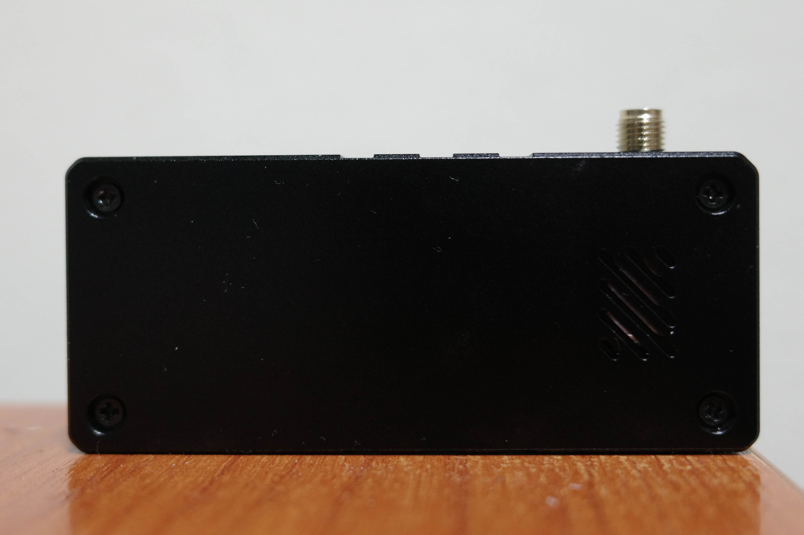

# MiniATS V4 (AMNVOLT) — ESP32-S3 + SI4732 Multi-Band Radio Receiver

Hands-on photos, specs, and technical notes for the **MiniATS V4** CNC-case receiver.  
This page summarizes both observed hardware details and the manufacturer’s stated changes from previous revisions.

---

## 📸 Photos

---

## ⚙️ Hardware Overview (observed on my CNC version)

### MCU / Module — ESP32-S3-WROOM-1 (Espressif)
- Dual-core Xtensa® LX7 @ 240 MHz  
- 384 KB ROM · 512 KB SRAM · 16 KB RTC SRAM · optional PSRAM ≤ 16 MB  
- **Wi-Fi 802.11 b/g/n**, up to 150 Mb/s  
- **Bluetooth LE 5** (1 / 2 Mb/s + coded PHY 125 / 500 Kb/s)  
- Internal coexistence between Wi-Fi and BLE on shared antenna  

### RF Receiver — Silicon Labs Si4732 DSP
- **FM:** 64 – 108 MHz **AM:** 520 – 1710 kHz  
- **SW:** 2.3 – 26.1 MHz **LW:** 153 – 279 kHz  
- RDS/RBDS · AFC/AGC · soft-mute · seek tuning · integrated LDO and VCO  

### Audio Subsystem
- **NS4160 Class D/AB Speaker Amplifier** — up to 5 W @ 5 V · THD 0.1 % @ 1 W · OCP/OTP/UVP protection  
- **TI LM4809 Headphone Amp** — 105 mW per channel (16 Ω) · THD+N 0.1 % · low-noise shutdown  

### Display
- 1.9″ IPS TFT 170×320 (ZJY190-1732TBWPG01) · FFC connection  

### Power
- Li-Po 3.7 V 800 mAh (cell 603040, 2.96 Wh)  
- USB-C for charging and firmware upgrade  

### Connectors / Controls
- SMA-K antenna jack  
- 3.5 mm stereo headphone output (can be used also as FM antenna)  
- USB-C (data + charge)  
- JST battery connector · BOOT/RESET buttons  
- Metal rotary encoder knob with set-screw lock  

### Enclosure
- CNC aluminium (this unit) or ABS moulded variant  

---

## 🔁 Change Set (V3S → V4)

- Front-end **Hi-Z input** stage (new RF interface)  
- **ESD-protected** antenna input with added diode  
- Shielded Si4732 RF module  
- Corrected L/R audio mapping · tuned speaker amp  
- Routed audio line from speaker out → GPIO 11 (for RTTY/CW decode in alt firmware; needs 0 Ω jumper)  
- High-Z circuit now powered from Si4732 VCC (cleaner rail)  
- USB-C firmware update support  
- FM antenna through headphone ground  
- New metal knob · stronger telescopic antenna  

---

## 🧪 Observations & Initial Tests

- The **CNC case** is solid and feels premium; the encoder knob locks with a set screw.  
- The **telescopic antenna** is better built but shorter in length.  
- The **donut antenna** remains unchanged and underperforms across most bands.  

### Reception & Performance
- Compared to a modified **MiniATS V3S**, the V4 shows **noticeably worse RF sensitivity**.  
- Likely cause: different High-Z input design and use of headphone ground as FM antenna.  
- The entire board ground acts as an antenna — even a USB cable behaves similarly.  
- This approach seems non-optimal and requires **reverse engineering** for confirmation.  

### Noise Behaviour
- Audible **clicks** occur on every encoder step or Wi-Fi activity.  
- Not screen-related (tested with display off).  
- Even with 50 Ω terminated antenna input, noise persists → likely power or ground coupling issue.  

---

## 🧰 Mods (so far)

- **0 Ω resistor (jumper) added** between speaker output and GPIO 11  
  Enables use with alternative firmware supporting **RTTY / CW decoding**.  
  This pad is already routed on the board but left unpopulated by default.

---

## ⚠️ Notes & Tips

- Use a standard 5 V USB-C charger (no QC/PD fast-charge).  
- Avoid deep Li-Po discharge; store cells around 3.7 – 3.85 V for long-term shelf life.  
- Headphones can act as FM antenna — better results with longer leads and strong signals.  

---

## 📜 License
- Text & images: **CC BY-SA 4.0**  
- Code (if any): **MIT**

