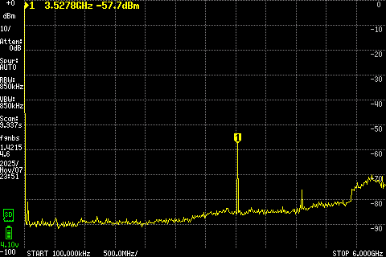
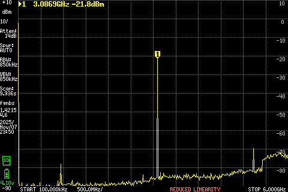
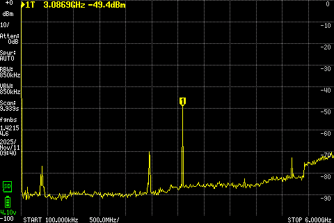

# 🛠️ Mini ATS V4 – Modifications & Improvements

## 📋 Overview
The **Mini ATS V4** is the latest revision of the well-known all-band receiver based on **ESP32-S3** and **SI4732**.  
While it introduces new features, it also suffers from **strong RF noise**, **VCO leakage**, and **poor ground isolation**.  
This document details the issues, precise measurements, and applied hardware fixes that significantly improve stability and reception quality.

---

## ⚠️ Original Issues

### 1. VCO Leakage from the SI4732
The SI4732’s internal **VCO (Voltage Controlled Oscillator)** radiates a strong signal around **3.3–3.46 GHz**, depending on the tuned frequency:

- ~3.3007 GHz at 150 kHz  
- ~3.4610 GHz at 108 MHz  

This leakage couples into the antenna input, creating audible interference and unpredictable RF behavior.

#### 📊 tinySA Ultra Measurements

| Model | Description | VCO Signal (dBm) | Screenshot |
|--------|--------------|------------------|-------------|
| **Mini ATS V2** | Older revision | −43.8 dBm |  |
| **Mini ATS V3S** | With coil mod | −57.7 dBm |  |
| **Mini ATS V4** | Stock board | **−21.8 dBm ⚠️** |  |
| **Mini ATS V4 (after coil mod)** | Improved version | **−49.4 dBm ✅** |  |

---

### 2. “Theremin Effect”
Touching the antenna (especially in **SSB mode**) caused tone shifts and unstable behavior — just like a *theremin*.  
The SI4732 shielding proved highly sensitive to touch and physical movement.

### 3. Encoder Clicks & Wi-Fi Spur
Turning or pressing the encoder produced **audible clicks** in the headphones, caused by RF coupling between the **ESP32 Wi-Fi**, **encoder lines**, and **audio amplifier**.

### 4. Headphone Jack as Antenna Input
The Mini ATS V4 attempted to use the headphone cable as an antenna via a **direct trace connection** between the jack and antenna input — without isolating the ground path.  
This design caused:
- Massive noise injection  
- Wi-Fi interference  
- Audio path instability  

---

## 🔧 Applied Fixes

### 1️⃣ Isolating Audio from RF
- **Removed the capacitor** linking the headphone output to the antenna input.  
- This isolates the audio ground from the RF path.  
- ✅ *Result:*  
  - No more encoder clicks  
  - Noticeable drop in Wi-Fi noise  

### 2️⃣ RF Shielding & Mechanical Stabilization
- Added **Kapton tape** over the **VBAT (+)** power switch pins to prevent accidental shorts — they sit dangerously close to the SI4732 shield.  
- Placed a small **thermal pad** over the SI4732 module to stabilize the shielding cover and reduce microphonic coupling.

### 3️⃣ Coil Mod (after Peter Neufeld)
- The **antenna trace** was cut **right after the SMA connector** — this point was chosen because the trace continues on the back side to an **ESD protection diode**, leaving no safe space further down.  
- Inserted a **7-turn, 2 mm diameter coil** in series between the SMA connector and antenna input.  
- The coil acts as an **RF choke**, drastically reducing VCO coupling and improving RF input stability.

---

## 🧰 Modification Steps

| Step | Description | Image |
|------|--------------|-------|
| 1️⃣ | Remove the SMA connector (soldered on both sides – handle carefully) |  |
| 2️⃣ | Cut the antenna trace just after the SMA (before the ESD diode path) |  |
| 3️⃣ | Re-solder the SMA connector |  |
| 3b️⃣ | Remove the coupling capacitor, add Kapton tape and a small thermal pad on the SI4732. Thermal pad is used as a spacer between the SI4732 and the shielding case, to reduce the effect that bending of the shield acting as an efficient atenna for the SI VCO |  |
| 4️⃣ | Add the 7-turn (2 mm) coil between SMA and RF input |  |

---

## 📈 Results

- The **theremin-effect** was completely eliminated.  
- Only a *very faint noise* remains when touching the **SMA base** (not the antenna).  
- **VCO leakage improved** from −21.8 dBm → −49.4 dBm.  
- **Wi-Fi** and **encoder** interference are practically gone.  
- RF reception is now stable and clean across all bands.

---

## 🧩 Summary Table

| Parameter | Before | After |
|------------|---------|-------|
| VCO Leakage | −21.8 dBm | −49.4 dBm |
| Wi-Fi Spur | High | Minimal |
| Encoder Click | Yes | No |
| Theremin Effect | Severe | None |
| RF Stability | Unstable | Stable |

---

## ✍️ Credits

- **Hardware Analysis & Mod:** [Antonis Maglaras (@vegos)](https://github.com/vegos)  
- **Original Coil Concept:** [Peter Neufeld](https://peterneufeld.wordpress.com/)  
- **Measurements:** tinySA Ultra  

---

## 📜 License
This modification guide is released under the **MIT License**.  
You are free to use, modify, and share it — please credit the original authors.

