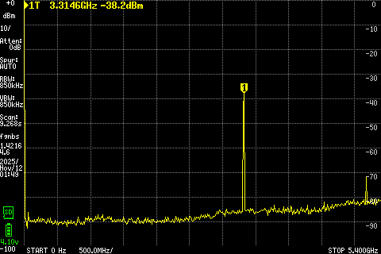
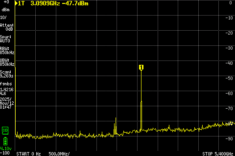

# 🛠️ Mini ATS V4 – Modifications & Improvements

## 📋 Overview
The **Mini ATS V4** is the latest revision of the well-known all-band receiver based on **ESP32-S3** and **SI4732**.  
While it introduces new features, it also suffers from **strong RF noise**, **VCO leakage**, and **poor ground isolation**.  
This document details the issues, measurements, and hardware fixes that significantly improve its stability and reception quality.

---

## ⚠️ Original Issues

### 1. VCO Leakage from the SI4732
The SI4732’s internal **VCO (Voltage Controlled Oscillator)** radiates a strong signal around **3.3–3.46 GHz**, depending on the tuned frequency:

- ~3.3007 GHz at 150 kHz  
- ~3.4610 GHz at 108 MHz  

This leakage couples into the antenna input, creating audible interference and unpredictable RF behavior.

#### 📊 tinySA Ultra Measurements

| Model | Description | VCO Signal (dBm) | Screenshot |
|--------|--------------|------------------|-------------|
| **Mini ATS V2** | Older revision | −43.8 dBm |  |
| **Mini ATS V3S** | With coil mod | −57.7 dBm |  |
| **Mini ATS V4** | Stock board | **−21.8 dBm ⚠️** |  |
| **Mini ATS V4 (after coil mod)** | Improved version | **−49.4 dBm ✅** |  |

---

### 2. “Theremin Effect”
Touching the antenna (especially in **SSB mode**) caused tone shifts and unstable behavior — similar to a *theremin*.  
The SI4732 shielding was highly sensitive to touch and even slight mechanical movement.

### 3. Encoder Clicks & Wi-Fi Spur
Turning or pressing the encoder produced **audible clicks** in the headphones, caused by RF coupling between the **ESP32 Wi-Fi**, **encoder lines**, and **audio amplifier**.

### 4. Headphone Jack as Antenna Input
The Mini ATS V4 attempted to use the headphone cable as an antenna via a **direct trace connection** between the jack and the antenna input — without isolating the ground path.  
This design caused:
- Heavy noise injection  
- Wi-Fi interference  
- Audio path instability  

---

## 🔧 Applied Fixes

### 1️⃣ Isolating Audio from RF
- **Removed the capacitor** linking the headphone output to the antenna input.  
- This isolates the audio ground from the RF path.  
- ✅ *Result:*  
  - No more encoder clicks  
  - Noticeable reduction in Wi-Fi noise  

### 2️⃣ RF Shielding & Mechanical Stabilization
- Added **Kapton tape** over the **VBAT (+)** power switch pins to prevent accidental shorts — they are dangerously close to the SI4732 shield.  
- Placed a small **thermal pad** on top of the SI4732 module to stabilize the shield cover and reduce microphonic coupling.

### 3️⃣ Coil Mod (after Peter Neufeld)
- The **antenna trace** was cut **immediately after the SMA connector**, because the trace continues on the back side to an **ESD protection diode** — leaving no space further down.  
- A **7-turn, 2 mm diameter coil** was inserted in series between the SMA connector and the antenna input.  
- The coil acts as an **RF choke**, drastically reducing VCO coupling and improving RF input stability.

---

## 🧰 Modification Steps

| Step | Description | Image |
|------|--------------|-------|
| 1️⃣ | Remove the SMA connector (soldered on both sides — handle carefully) |  |
| 2️⃣ | Cut the antenna trace just after the SMA (before the ESD diode path) |  |
| 3️⃣ | Re-solder the SMA connector |  |
| 3b️⃣ | Remove the coupling capacitor, add Kapton tape and a small thermal pad on the SI4732. The pad acts as a spacer between the chip and the shielding can, reducing the shield’s tendency to behave as an efficient antenna for the SI4732 VCO. |  |
| 4️⃣ | Add the 7-turn (2 mm) coil between SMA and RF input |  |

---

## 📈 Results

- The **theremin-effect** was completely eliminated.  
- Only a *very faint noise* remains when touching the **SMA base** (not the antenna).  
- **VCO leakage improved** from −21.8 dBm → −49.4 dBm.  
- **Wi-Fi** and **encoder** interference are practically gone.  
- RF reception is now stable and clean across all bands.

---

## 🧩 Summary Table

| Parameter | Before | After |
|------------|---------|-------|
| VCO Leakage | −21.8 dBm | −49.4 dBm |
| Wi-Fi Spur | High | Minimal |
| Encoder Click | Yes | No |
| Theremin Effect | Severe | None |
| RF Stability | Unstable | Stable |

---

## 🌀 Coil Specification

- **Type:** Air-core RF choke  
- **Turns:** 7 turns  
- **Core diameter:** ≈ 2 mm (wound on a drill bit or similar)  
- **Wire:** Enamelled copper, Ø 0.2 mm  
- **Inductance:** Not critical — the goal is to provide high impedance around 3 GHz, attenuating VCO leakage while maintaining broadband HF/VHF response.  
- **Installation note:** The coil is placed in series between the SMA connector and the antenna trace immediately after the cut point.

---

## 🧪 Measurement Setup (reproducibility)

- **Instrument:** tinySA Ultra+  
- **Span:** 100 kHz → 6.000 GHz  
- **RBW/VBW:** 850 kHz / 850 kHz  
- **Reference / Attenuation:** 0 dBm / 0 dB  
- **Marker (examples):**  
  - Mini ATS V2 / V3S ≈ **3.527 GHz**  
  - Mini ATS V4 / V4 + coil ≈ **3.087 GHz**  
- **Notes:**  
  - Antenna fully disconnected  
  - **Battery disconnected** during all work and measurements  
  - SI4732 shield in place  
  - SMA base touched only for the *“residual noise at SMA base”* test  

---

## 📡 Additional Measurements Across the Tuning Range

To further confirm the coil’s effectiveness throughout the full reception range, additional measurements were taken on the **Mini ATS V4 (with coil mod)** at representative tuning points:

| Tuned Frequency | VCO Frequency | Measured Level | Screenshot |
|-----------------|----------------|----------------|-------------|
| **150 kHz** (start of reception range/MW) | 3.3146 GHz | −38.2 dBm |  |
| **10 MHz** (low-HF region/SW) | 3.2111 GHz | −42.4 dBm |  |
| **27 MHz** (mid-HF band/almost end of SW reception) | 3.0909 GHz | −47.7 dBm |  |
| **108 MHz** (end of reception range/VHF) | 3.4635 GHz | −35.4 dBm |  |

These measurements confirm that the **coil maintains effective suppression** of the SI4732 VCO leakage across the entire tuning range.  
The VCO output remains reduced by approximately **25 – 30 dB** compared to the unmodified board, with slight variations depending on frequency — consistent with the internal behavior of the SI4732 PLL and the broadband impedance profile of the added RF choke.

---

## ⚠️ Safety Notes

- Disconnect the **battery** before any soldering or cutting operations.  
- Use ESD precautions.  
- The SMA connector is soldered on **both sides** of the PCB — use controlled heat to avoid pad lifting.  
- All modifications are done **at your own risk** and will **void any warranty**.

---

## ✍️ Credits

- **Original Concept:** [Peter Neufeld](https://peterneufeld.wordpress.com/)  
- **Documentation & Implementation:** [Antonis Maglaras (@vegos)](https://github.com/vegos)  

---

## 📜 License
This modification guide is released under the **MIT License**.  
You are free to use, modify, and share it — please credit the original authors.
