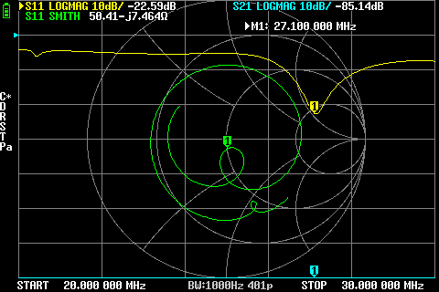
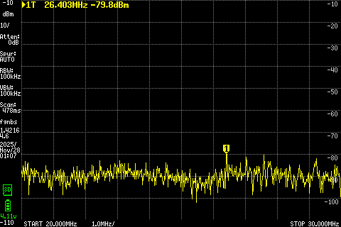

# Sirio Boomerang 27A – Reference Measurements (20–30 MHz)

This document contains the **reference measurements** of the **Sirio Boomerang 27A** across **20–30 MHz**, intended for later comparison against the **Sirio GPS 1/2 (½-wave)** antenna.

## Antenna Description (Manufacturer Specs)

- **Type**: 1/4 λ ground-plane (boomerang)
- **Radiation pattern**: Omnidirectional
- **Polarization**: Vertical
- **Frequency range**: 26.8–27.6 MHz (tunable)
- **Systems**: CB / 10 m
- **Gain**: 0 dBd (≈ 2.15 dBi)
- **Bandwidth**: ≥ 800 kHz @ SWR ≤ 2
- **Max Power**:
  - 300 W CW (continuous)
  - 900 W CW (short time)
- **Connector**: SO-239 (UHF female)

---

## Measurement Setup

- **Antenna**: Sirio Boomerang 27A. The antenna was initially tuned near CB Channel 20 (~27.205 MHz), 
  but after the whip was bent more than usual (increasing the effective electrical length), 
  the tuning shifted downwards and the minimum SWR moved close to CB Channel 10 (~27.105 MHz).
- **Purpose**: Used for CB transmit/receive with a CRT SS9900V.
- **Instruments**:
  - **NanoVNA** – S11 / SWR / Return Loss sweep.
  - **tinySA** – Spectrum scan of received RF power/ambient noise.
- **Sweep Range**: 20–30 MHz

### Environmental & Installation Conditions (important)

These measurements were taken:

- with **~15 meters of RG58 coaxial cable**,  
- in a **densely built urban environment**,  
- with the antenna installed at a **significantly lower height than the surrounding buildings**.

These factors inherently reduce absolute received levels and may slightly affect the apparent bandwidth and matching due to interaction with nearby structures.  
However, they do not impact the relative comparison with later measurements, provided the new antenna is tested under the same conditions.

---

## 1. NanoVNA – S11 / SWR / Return Loss (20–30 MHz)

### Key Results

- **Minimum SWR**:
  - Frequency: **27.125 MHz**
  - SWR_min ≈ **1.16 : 1**
  - Return Loss ≈ **22.75 dB**
  - Mismatch loss ≈ **0.02 dB** (essentially perfect)

- **Bandwidth for SWR ≤ 2 : 1**:
  - From **26.35 MHz** to **28.325 MHz**
  - Total BW ≈ **1.975 MHz**
  - Easily covers the entire CB band and the lower portion of the 10 m band.

- **Approximate SWR ≤ 3 : 1**:
  - ~**25.7–30 MHz**
  - Adequate for wide-band reception.

### Representative Frequencies (CB, 10 m, and 15 m region)

> Note: 21.000 MHz lies in the **15 m amateur band region** (21.000–21.450 MHz).

| Frequency (MHz) | Sample (MHz) | SWR  | RL (dB) | Mismatch Loss (dB) | Notes                                      |
|-----------------|--------------|------|---------|---------------------|--------------------------------------------|
| 21.000          | 21.000       | 3.90 | 4.56    | 1.87                | 15 m band region, usable mainly for RX     |
| 26.965 (CH1)    | 26.975       | 1.21 | 20.3    | 0.04                | Very good match                            |
| 27.125          | 27.125       | 1.16 | 22.75   | 0.02                | Minimum SWR                                |
| 27.185 (CH19)   | 27.175       | 1.16 | 22.6    | 0.02                | Excellent center performance               |
| 27.405 (CH40)   | 27.400       | 1.27 | 18.45   | 0.06                | Upper CB, still excellent                  |
| 27.700          | 27.700       | 1.50 | 13.97   | 0.18                | Usable for TX without issue                |
| 28.000          | 28.000       | 1.75 | 11.31   | 0.33                | Lower 10 m band                            |

> **NanoVNA Summary**  
> The Boomerang 27A is very well tuned at ~27.1 MHz and provides excellent matching across the entire CB band.  
> Around **21 MHz (15 m region)** the SWR (~3.9) and mismatch loss (~1.9 dB) are perfectly acceptable for **reception**, but a tuner is strongly recommended if it is ever used for TX there.

---

## 2. tinySA – Spectrum Analysis (20–30 MHz)

The tinySA measurement shows **ambient RF activity and noise**, not impedance matching.  
During this scan, there was active CB traffic around the lower channels (e.g., CH12), which is visible in the spectrum.

### Scan Settings

- Start: **20 MHz**
- Stop: **30 MHz**
- RBW: **10 kHz**
- Attenuation: **0 dB**

### Average Level per 2 MHz Segment

| Range (MHz) | Avg (dBm) | Min (dBm) | Max (dBm) | Notes                           |
|-------------|-----------|-----------|-----------|---------------------------------|
| 20–22       | −90.28    | −100.81   | −83.28    | Relatively quiet                |
| 22–24       | −88.81    | −96.31    | −81.81    | Mild activity                   |
| 24–26       | −91.47    | −102.31   | −84.81    | Mostly quiet                    |
| 26–28       | **−88.55**| −97.31    | **−80.81**| Most active region (CB)         |
| 28–30       | −91.19    | −99.31    | −85.31    | Quiet again                     |

- **Peak level** observed:
  - ~**−80.8 dBm** around **26.88 MHz**

This aligns with:

- active CB traffic, and
- the antenna’s optimal tuning around 27 MHz.

### Notable Frequencies

Including also a point near **21 MHz (15 m region)**:

| Frequency (MHz) | Sample (MHz) | Level (dBm) | Notes                               |
|-----------------|--------------|-------------|-------------------------------------|
| 21.000          | 21.002       | −92.78      | 15 m region, relatively quiet       |
| 26.965          | 26.971       | −86.31      | Active at the time                  |
| 27.185          | 27.194       | −90.31      | Moderate activity                   |
| 27.405          | 27.394       | −85.31      | Stronger signals present            |
| 27.700          | 27.706       | −92.31      | Quiet during measurement            |
| 28.000          | 27.996       | −91.31      | Typical low 10 m activity           |

> **tinySA Summary**  
> The 26–28 MHz region shows the strongest overall RF presence, which matches both the antenna’s tuning and the real CB activity during the measurement period.  
> Around **21 MHz**, the band was relatively quiet at the time of measurement, and the lower received level also reflects the poorer impedance match compared to the CB segment.

---

## 3. Combined Interpretation (NanoVNA + tinySA)

Looking at both the impedance (NanoVNA) and the received RF spectrum (tinySA), a few additional conclusions can be drawn:

1. **On the CB band (11 m), the system is not mismatch-limited**

   The NanoVNA shows excellent matching from roughly 26.9 to 27.7 MHz (SWR ~1.2–1.5, mismatch loss < 0.2 dB), while the tinySA clearly shows that the 26–28 MHz region is the most active and “RF-rich” part of the 20–30 MHz spectrum.

   This means that, on CB, the overall performance is primarily limited by:
   - the antenna’s radiation pattern (¼-wave vertical),
   - the urban noise environment,
   - and propagation conditions,

   rather than by feedline mismatch or poor tuning.  
   Any future improvement with a ½-wave antenna will therefore mostly reflect **real antenna/pattern gain**, not just “better SWR”.

2. **Around 21 MHz (15 m region), the antenna is usable for RX but clearly sub-optimal for TX**

   At 21.000 MHz, the NanoVNA reports SWR ≈ 3.9 and a mismatch loss of ~1.9 dB. The tinySA also shows relatively low activity and lower received levels in this part of the spectrum during the measurement.

   The reduced performance at 21 MHz is therefore a combination of:
   - poorer impedance matching,
   - less RF activity / propagation at the time,
   - and the fact that the antenna is physically designed and tuned for ~27 MHz.

   In practice, the Boomerang 27A can still be used as a **general-purpose receive antenna** in the 15 m region, but a tuner (and ideally a more suitable radiator) would be strongly recommended for transmit.

3. **No obvious anomalous resonances or pathological behaviour**

   The 20–30 MHz NanoVNA sweep does not show unexpected secondary resonances in this range, and the tinySA trace does not reveal any abnormal narrow-band spikes that would suggest strong local interference or odd coupling effects in the measurement setup.

   Overall, the antenna + feedline + environment behave as a “normal” ¼-wave vertical tuned for CB around 27 MHz. This makes these measurements a solid and trustworthy baseline for future comparison with the Sirio GPS 1/2 (½-wave) antenna under the same conditions.

---

**Related:**  
- [Comparison: Sirio GPS 1/2 vs Sirio Boomerang 27A](../Sirio_GPS_1-2_vs_Boomerang_27A/)
