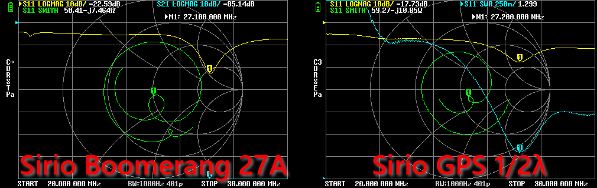

# Antenna Comparison – Sirio Boomerang 27A vs Sirio GPS 1/2

This document compares the **Sirio Boomerang 27A (¼-wave)** and the **Sirio GPS 1/2 (½-wave)** antennas,
based on real-world measurements performed with **NanoVNA** and **tinySA** across **20–30 MHz**.

Both antennas were measured using the **same feedline, instruments, sweep ranges, and environmental conditions** (mounted on the same mast, same position),
allowing a meaningful side-by-side comparison.

---

## Measurement Conditions (Common)

- **Coaxial feedline**: ~15 m RG58
- **Environment**: Densely built urban area
- **Antenna height**: Significantly lower than surrounding buildings
- **Instruments**:
  - NanoVNA (S11 / SWR / Return Loss)
  - tinySA (received RF spectrum / ambient noise)
- **Sweep range**: 20–30 MHz
- **Primary use case**: CB transmit/receive

---

## 1. Electrical Behaviour (NanoVNA)

### SWR Minimum

| Antenna | Frequency (MHz) | SWR_min |
|-------|------------------|---------|
| **Boomerang 27A** | ~27.125 | ~1.16 |
| **GPS 1/2** | ~27.225 | ~1.30 |

- The Boomerang reaches a **lower absolute SWR minimum**.
- The GPS 1/2 trades a slightly higher minimum for much broader stability.

---

### Usable Bandwidth (SWR ≤ 2)

| Antenna | Frequency Range (MHz) | Approx. Bandwidth |
|-------|------------------------|-------------------|
| **Boomerang 27A** | ~26.35 – 28.33 | ~2.0 MHz |
| **GPS 1/2** | ~25.8 – ≥30.0 | ≥4.2 MHz |

- The GPS 1/2 demonstrates **more than double the usable bandwidth**.
- Manufacturer specs:
  - Boomerang 27A: ≥ 0.8 MHz @ SWR ≤ 2
  - GPS 1/2: ≥ 1.6 MHz @ SWR ≤ 2
- In this installation, both antennas exceed their rated bandwidth, with the GPS 1/2 doing so by a large margin.

---

### Representative Frequencies (SWR)

| Frequency | Boomerang 27A | GPS 1/2 | Observation |
|---------|---------------|---------|-------------|
| 26.965 (CH1) | ~1.21 | ~1.34 | Both excellent |
| 27.185 (CH19) | ~1.16 | ~1.30 | Boomerang slightly better |
| 27.405 (CH40) | ~1.27 | ~1.33 | Essentially equivalent |
| 27.700 | ~1.50 | ~1.45 | GPS 1/2 slightly better |
| 28.000 | ~1.75 | ~1.58 | GPS 1/2 clearly better |
| 21.000 | ~3.90 | ~3.24 | GPS 1/2 less mismatched |

---

## 2. Received RF Levels (tinySA)

> Note: tinySA reflects **real-time RF activity and noise**, not antenna gain alone.
> Differences must be interpreted with caution and preferably confirmed by repeated measurements.

### Average Level per 2 MHz Segment (Avg dBm)

| Range (MHz) | Boomerang 27A | GPS 1/2 | Δ GPS − Boom |
|------------|---------------|---------|-------------|
| 20–22 | −90.28 | −85.96 | **+4.3 dB** |
| 22–24 | −88.81 | −87.68 | **+1.1 dB** |
| 24–26 | −91.47 | −88.62 | **+2.9 dB** |
| 26–28 | −88.55 | −86.00 | **+2.6 dB** |
| 28–30 | −91.19 | −88.35 | **+2.8 dB** |

---

### Notable Frequencies (tinySA)

| Frequency | Boomerang (dBm) | GPS 1/2 (dBm) | Δ GPS − Boom |
|---------|------------------|---------------|-------------|
| 21.000 | −92.78 | −87.75 | **+5.0 dB** |
| 26.965 | −86.31 | −84.28 | **+2.0 dB** |
| 27.185 | −90.31 | −85.28 | **+5.0 dB** |
| 27.405 | −85.31 | −87.78 | −2.5 dB |
| 27.700 | −92.31 | −84.28 | **+8.0 dB** |
| 28.000 | −91.31 | −85.78 | **+5.5 dB** |

---

## 3. Interpretation

### Impedance vs. Real-World Performance

- The **Boomerang 27A** offers excellent matching at its tuned frequency and performs very well within the CB band,
  but its usable bandwidth is comparatively narrow.
- The **GPS 1/2** provides a **much wider low-SWR region**, making it less sensitive to tuning, installation height,
  and nearby structures.

### Broadband Behaviour

- The GPS 1/2 behaves as a **broadband, electrically stable radiator**.
- Its performance advantage becomes more pronounced:
  - outside the core CB band,
  - around 27.700 MHz,
  - and into the lower 10 m band.

### Received Signal Levels

- In these measurements, the GPS 1/2 generally shows **higher received RF levels** across most of the 20–30 MHz range.
- While part of this can be attributed to real-time band activity, the consistency across multiple segments
  suggests **better overall RF coupling** in this installation.

---

## 4. SWR vs Frequency – Comparative Behaviour

Examining the SWR curves across the full 20–30 MHz sweep highlights a clear difference in electrical behaviour
between the two antennas:

- **Sirio Boomerang 27A**
  - Exhibits a deeper SWR minimum (~1.16) near its tuning point.
  - SWR rises more rapidly outside the core CB band.
  - Behaviour is characteristic of a more narrowly tuned ¼-wave antenna.

- **Sirio GPS 1/2**
  - Shows a slightly higher minimum SWR (~1.30).
  - Maintains a much flatter SWR curve over a significantly wider frequency range.
  - SWR remains ≤ 2 well beyond the CB band and into the lower 10 m region.

From a system-level perspective, the GPS 1/2 trades a slightly higher absolute minimum SWR for
**substantially improved frequency stability and bandwidth**, making it less sensitive to tuning
and environmental detuning effects.

---

## 5. Summary – Strengths by Use Case

| Aspect / Use Case | Boomerang 27A (¼λ) | GPS 1/2 (½λ) | Notes |
|------------------|-------------------|--------------|-------|
| Absolute SWR minimum | ✅ Better | ◻ Slightly higher | Boomerang reaches ~1.16 |
| SWR flatness | ◻ | ✅ Better | GPS 1/2 remains flat over wide range |
| Usable bandwidth (SWR ≤ 2) | ◻ ~2 MHz | ✅ ≥4 MHz | GPS 1/2 clearly superior |
| CB band (26.9–27.4 MHz) | ✅ Excellent | ✅ Excellent | Both perform very well |
| Operation at 27.700 MHz | ◻ Good | ✅ Better | Lower SWR, wider margin |
| Lower 10 m band (28.0 MHz) | ◻ Marginal | ✅ Usable | GPS 1/2 advantage |
| 15 m band (21 MHz) | ◻ RX only | ◻ RX only (less mismatch) | Neither is optimal |
| Sensitivity to installation | ◻ Higher | ✅ Lower | GPS 1/2 more forgiving |
| Broadband behaviour | ◻ Limited | ✅ Strong | Fundamental design difference |
| Versatility | ◻ CB-focused | ✅ Multi-band tolerant | Practical takeaway |

Legend:
- ✅ = clear advantage
- ◻ = acceptable / neutral

---

## 6. Practical Conclusions

  

- For **CB-only operation**, both antennas perform well; the Boomerang slightly favors absolute SWR.
- For **CB + extended operation (27.700 MHz, 10 m)**, the GPS 1/2 is clearly superior.
- The GPS 1/2 offers:
  - wider usable bandwidth,
  - greater tolerance to environmental effects,
  - and more consistent performance across adjacent bands.

Overall, the Sirio GPS 1/2 represents a **more versatile and forgiving antenna**, while the Boomerang 27A remains
a solid and efficient solution for narrowly focused CB operation.

---

## 7. Notes

- All measurements were performed without an antenna tuner.
- Results reflect this specific installation and environment.
- Repeating the tinySA measurements at different times and propagation conditions would further improve statistical confidence.

---

### Detailed Tests

- [Sirio GPS 1/2](../Sirio_GPS_1-2/)
- [Sirio Boomerang 27A](../Sirio_Boomerang_27A/)
