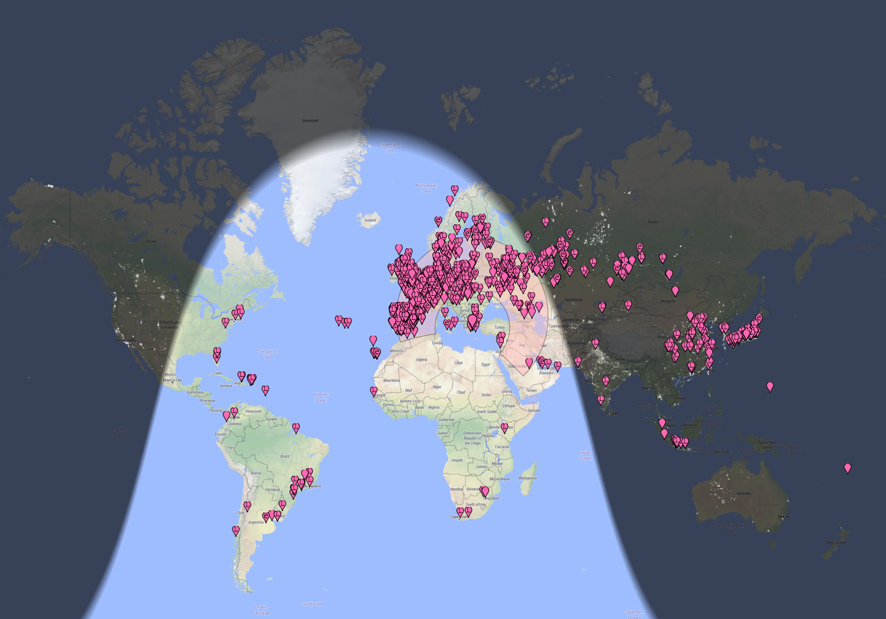
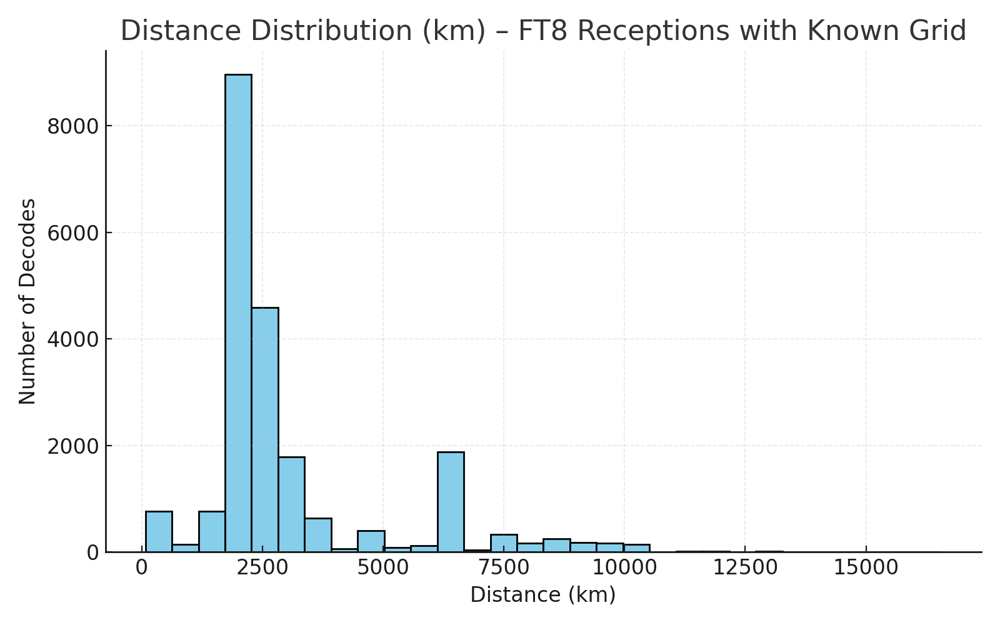
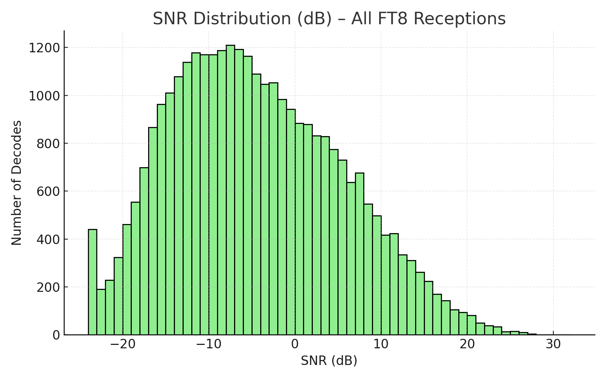

# FT8 Report (28.074 MHz) — CRT SS9900V & Sirio Boomerang 27A

Analysis of FT8 decodes from WSJT-X, received using **CRT SS9900V** and **Sirio Boomerang 27A**,  
QTH **KM17UW (Greece)**.

---

## 🌏 Reception Map

  

---

## 📊 Summary

| Metric | Value |
|--------|-------|
| **Total decodes** | 31,351 |
| **Unique messages** | 11,839 |
| **Time range** | 2025-10-30 05:36 → 12:42 UTC |
| **Average / Min / Max SNR** | −5.0 / −24 / +31 dB |
| **Average DT** | −0.15 s |
| **Decodes with known grid** | 21,513 |
| **Unique stations with grid** | 1,227 |
| **Average distance (with grid)** | ~3,071 km |
| **Maximum distance (with grid)** | **16,564 km** |

---

## 🌏 Farthest DX

| Callsign | Grid | Distance (km) | Best SNR | Count |
|-----------|------|---------------|-----------|--------|
| **3D2USU** | RH82 (Western Fiji) | **16,564 km** | −15 dB | 5 |

---

## 📡 Band Conditions

### Distance Distribution

Most decodes were between **2,000–3,000 km**, corresponding to **Europe & Middle East** paths.  
A secondary lobe appears between **6,000–10,000 km**, representing **Asia**,  
and the longest DX tail reaches **16,564 km (Oceania)**.

---

### SNR Distribution

SNR values center around **−5 dB**, with a smooth positive tail up to **+31 dB**,  
indicating excellent propagation and a clean receive path.

---

### 🌏 Top 15 DX Stations (by distance)

| # | Callsign | Grid | Distance (km) | Best SNR (dB) | Count |
|--:|:----------|:------|---------------:|---------------:|------:|
| 1 | **3D2USU** | RH82 | **16 564** | −15 | 5 |
| 2 | **JA6CDC** | PM53 | 9 472 | −18 | 24 |
| 3 | **JA7QVI** | QM08 | 9 287 | −16 | 12 |
| 4 | **JA1VOK** | PM95 | 9 116 | −17 | 9 |
| 5 | **JA0RUG** | PM97 | 9 035 | −19 | 11 |
| 6 | **YB1DOQ** | OI33 | 8 967 | −20 | 8 |
| 7 | **BV1EK** | PL04 | 8 701 | −15 | 7 |
| 8 | **HS0ZKM** | OK03 | 8 112 | −13 | 10 |
| 9 | **E21EIC** | OK04 | 8 068 | −12 | 6 |
| 10 | **A92GE** | LL56 | 7 775 | −11 | 13 |
| 11 | **9V1XX** | OJ11 | 7 705 | −14 | 5 |
| 12 | **VK8MS** | PH57 | 7 584 | −18 | 4 |
| 13 | **4S7VG** | MJ96 | 7 412 | −10 | 8 |
| 14 | **VU2XO** | MK82 | 7 306 | −16 | 6 |
| 15 | **UN8GEQ** | MN83 | 7 280 | −15 | 9 |

---

### 🏆 Top 15 Strongest Stations (by best SNR)

| # | Callsign | Grid | Best SNR (dB) | Worst SNR (dB) | Count | Max Distance (km) |
|--:|:----------|:------|:-------------|:---------------|------:|------------------:|
| 1 | **JA6CDC** | PM53 | **31** | −18 | 24 | 9,472 |
| 2 | **IK0TUM** | JN61 | 30 | −22 | 37 | 972 |
| 3 | **SV1EJD** | KM17 | 29 | −14 | 56 | 32 |
| 4 | **EA3EP** | JN11 | 28 | −19 | 41 | 1,740 |
| 5 | **LZ1WG** | KN22 | 28 | −16 | 29 | 535 |
| 6 | **YO4AAC** | KN44 | 27 | −18 | 18 | 734 |
| 7 | **DL1YAW** | JO41 | 27 | −20 | 33 | 1,842 |
| 8 | **IZ8NXG** | JM88 | 26 | −17 | 23 | 876 |
| 9 | **9A7YY** | JN85 | 26 | −21 | 22 | 1,080 |
| 10 | **SV2BXA** | KN10 | 25 | −18 | 44 | 364 |
| 11 | **F4HMX** | JN18 | 25 | −23 | 19 | 2,103 |
| 12 | **EA5IKT** | IM99 | 24 | −20 | 20 | 1,984 |
| 13 | **YO9IPF** | KN34 | 24 | −19 | 27 | 667 |
| 14 | **CT1DMC** | IN50 | 23 | −21 | 18 | 2,341 |
| 15 | **I1YRL** | JN35 | 23 | −22 | 12 | 1,505 |

---

## ⚙️ Notes & Methodology

- Distances calculated from **KM17UW** to the **Maidenhead grid** contained in each FT8 message.  
- Only messages with valid grids were used for distance stats.  
- QSO-type lines without grids (e.g. `JA6CDC 5Z4VJ −12`) counted for SNR/DT stats but excluded from distance charts.  
- Charts and stats generated directly from WSJT-X log data (no external sources).

---

## 🧭 Summary

Performance of the **CRT SS9900V** with **Sirio Boomerang 27A**:  
- Over **31k decodes**, **1.2k unique stations**,  
- and a stunning **16,564 km** best DX (Fiji).  

Note:  
&nbsp;&nbsp;&nbsp;&nbsp;Sirio Boomerang 27A is a compact antenna (1/4 λ, 26.8-27.6 MHz, 3600 mm height) and it's mounted place is between buildings.  
&nbsp;&nbsp;&nbsp;&nbsp;Coax is about 15 meters of RG58.  

[Full log file](./CRT_SS990V_Sirio_Boomerang.txt)  
