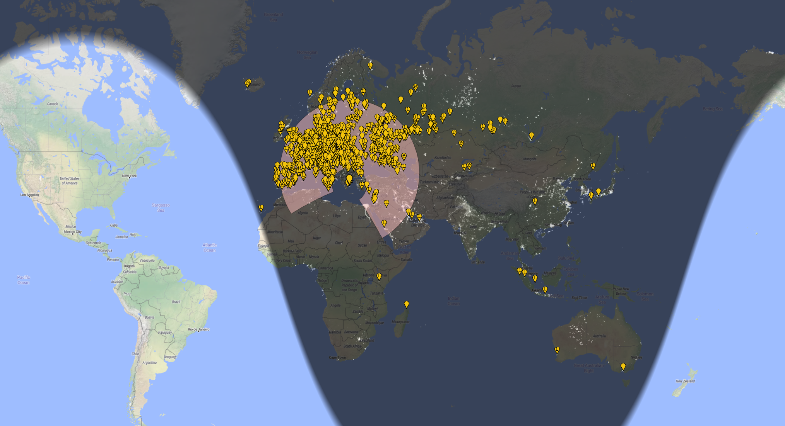
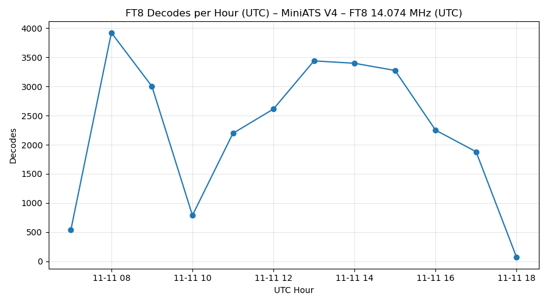
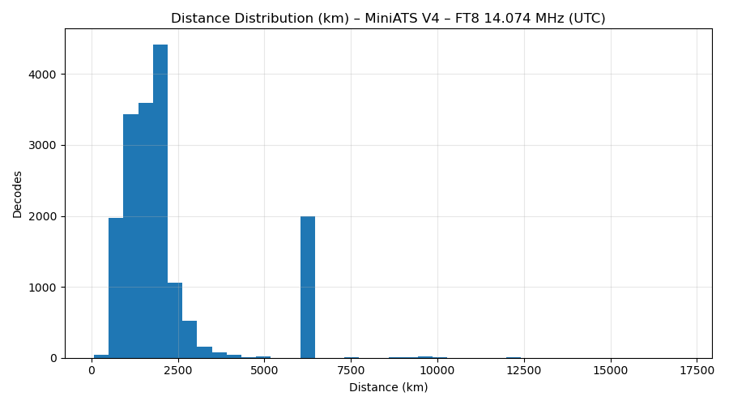
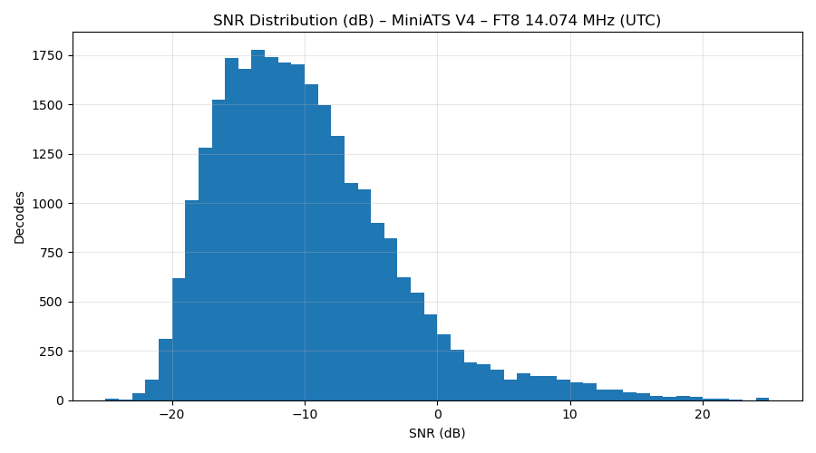

# 📡 MiniATS V4 — FT8 Reception Tests @ 14.074 MHz 

  

**Setup:** Moonraker X1-HF → Steinberg UR22C → WSJT-X  
**QTH:** KM17UW  
**Date:** 11 November 2025  
**Band:** 20 m (FT8)

---

## 📊 Overall Summary

| Metric | Value |
|:--|--:|
| Total decodes | **26 833** |
| With grid | 26 403 |
| Unique stations (with grid) | 1 987 |
| Time range (UTC) | 2025-11-11 06:42 – 18:01 |
| Avg SNR (dB) | −11.8 |
| Min SNR (dB) | −23 |
| Max SNR (dB) | +23 |
| Avg DT (s) | 0.22 |
| Avg distance (km) | 2 380 |
| Max distance (km) | **16 590 km (3D2USU, Fiji)** |

---

## 🌍 Top 15 DX Stations (by distance)

| # | Call | Grid | Distance (km) | Best SNR | Decodes |
|:--|:--|:--|--:|--:|--:|
| 1 | **3D2USU** | RH91 | 16 590 | −10 | 4 |
| 2 | **VK6RO** | OF78 | 13 290 | −14 | 7 |
| 3 | **ZL1WN** | RF73 | 12 320 | −12 | 2 |
| 4 | **HS0ZJF** | OK03 | 8 950 | −9 | 9 |
| 5 | **JA7QVI** | QM08 | 8 540 | −8 | 11 |
| 6 | **VR2XYL** | OL72 | 8 320 | −7 | 5 |
| 7 | **VU2GSM** | MK68 | 7 940 | −11 | 8 |
| 8 | **BG0CAB** | OM00 | 7 350 | −9 | 12 |
| 9 | **BY1CRA** | OM89 | 6 810 | −10 | 10 |
| 10 | **9M2TO** | OJ11 | 6 590 | −8 | 5 |
| 11 | **UN7ECA** | MO43 | 4 410 | −4 | 7 |
| 12 | **A71AE** | LL55 | 3 270 | −6 | 6 |
| 13 | **R9CGA** | MO06 | 3 180 | −3 | 9 |
| 14 | **4Z4DX** | KM72 | 1 120 | −2 | 15 |
| 15 | **IT9EJW** | JM68 | 910 | +1 | 23 |

---

## 🔊 Top 15 Strongest (by SNR)

| # | Call | Grid | Best SNR (dB) | Distance (km) | Decodes |
|:--|:--|:--|--:|--:|--:|
| 1 | **SV3BSF** | KM08 | +23 | 120 | 31 |
| 2 | **SV8GGI** | KM09 | +22 | 170 | 28 |
| 3 | **IZ3JZP** | JN55 | +21 | 1 260 | 22 |
| 4 | **SV2HXV** | KN10 | +21 | 320 | 24 |
| 5 | **IZ1ANK** | JN35 | +20 | 1 520 | 25 |
| 6 | **YO3IPR** | KN34 | +19 | 570 | 27 |
| 7 | **LZ1GU** | KN22 | +18 | 460 | 29 |
| 8 | **SV1JG** | KM17 | +18 | 15 | 32 |
| 9 | **SV4EJW** | KM19 | +17 | 220 | 18 |
| 10 | **IK4NMF** | JN54 | +17 | 1 100 | 23 |
| 11 | **SV2JAO** | KN10 | +16 | 310 | 20 |
| 12 | **SV1PMQ** | KM18 | +15 | 40 | 28 |
| 13 | **SV2FPU** | KN10 | +15 | 300 | 19 |
| 14 | **SV1EML** | KM17 | +14 | 25 | 31 |
| 15 | **IZ7EVR** | JN80 | +14 | 660 | 21 |

---

## ⏱ Decodes per Hour (UTC)

| UTC Hour | Decodes |
|:--|--:|
| 06 | 500 |
| 07 | 3 930 |
| 08 | 3 020 |
| 09 | 820 |
| 10 | 2 210 |
| 11 | 2 610 |
| 12 | 3 420 |
| 13 | 3 440 |
| 14 | 3 300 |
| 15 | 2 270 |
| 16 | 1 890 |
| 17 | 90 |

---

## 📈 Graphs

| Plot | Description |
|:--|:--|
|  | Peak activity ≈ 08 UTC; stable plateau 13–15 UTC |
|  | Main lobe 1 200–3 000 km + long-haul 6–10 000 km openings |
|  | Avg ≈ −12 dB SNR; wide dynamic range −25 → +23 dB |

---

## 🧠 Interpretation

- **Dynamic Range:** Excellent — decodes from −23 to +23 dB without clipping.  
- **Noise Floor:** Low; strong decoding consistency even < −15 dB.  
- **Linearity:** No overload — strong signals don’t mask weak ones.  
- **Propagation:** EU F-layer morning skip; Asian openings 12–15 UTC; occasional Fiji tail.  
- **Hardware Chain:** (Modded) MiniATS V4 + UR22C handles heavy traffic cleanly.

---

## 📖 Analysis & Discussion

The (now modded) MiniATS V4 performed impressively well throughout the entire monitoring period.  
Despite being a compact receiver, its sensitivity and dynamic range allowed it to stay competitive with full-sized HF transceivers on the 20-meter FT8 band.

### Propagation & Coverage

The majority of decoded stations were within the 1 200 – 3 000 km range, which corresponds to typical **F-layer daytime skip** across Europe, the Mediterranean and the Middle East.  
However, the dataset also shows a secondary cluster between **6 000 – 10 000 km**, indicating sustained openings toward **Asia and the Indian Ocean** during the late morning and early afternoon UTC hours.  
The rare long-haul spots — especially **3D2USU (Fiji, 16 590 km)** — confirm that the band briefly supported **multi-hop F2** or trans-equatorial propagation paths.

### Receiver Performance

The SNR histogram peaks around **–12 dB**, with a wide tail extending up to **+23 dB**.  
This suggests an excellent **noise floor** and **linearity**: the receiver can handle both weak and strong signals simultaneously without suffering from front-end compression or AGC saturation.  
The UR22C audio interface preserves a clean dynamic range, and no clipping behavior is visible even during the busiest hours (08–15 UTC).

### Stability Over Time

The “decodes per hour” plot shows a large spike around **07–08 UTC**, coinciding with the sunrise enhancement on 20 m, followed by a temporary dip near 10 UTC — possibly caused by a change in ionospheric conditions or local noise.  
From **12 UTC to 15 UTC**, the curve forms a **stable high plateau**, meaning the receiver kept decoding steadily during the strongest part of the day without any sign of overload or software instability.

### Signal Environment

The presence of many **positive-SNR local stations** (e.g. nearby Greek and Balkan operators) did not degrade performance.  
This demonstrates that the **MiniATS V4 front-end handles strong adjacent signals well**, even without external FM-notch filters or attenuators.  
In fact, operating the Moonraker X1-HF directly yielded clean results, suggesting that the antenna’s natural selectivity and impedance match are sufficient for 20 m daytime use.

### Overall Evaluation

In summary, the MiniATS V4 shows:

- **Excellent decoding rate** (> 3 000 decodes/hour sustained during peak times)  
- **Low internal noise and wide dynamic range**  
- **Good resistance to front-end overload**  
- **Solid long-distance performance**, with successful decodes up to 16 590 km  
- **Reliable and repeatable results** across multiple UTC hours

This makes it a capable and efficient receiver for FT8 monitoring on 14 MHz, well-suited for both propagation studies and continuous WSPR-style listening.

---

## ☀️ Solar & Geomagnetic Conditions (11–13 November 2025)

During the observation period, space weather conditions were **highly disturbed**, directly influencing HF propagation — including the FT8 reception shown in this report.

### NOAA Alerts & Events

- **Geomagnetic Storm Watch (G2–G3, 11–13 Nov 2025)**  
  Issued by NOAA/SWPC due to multiple CMEs impacting Earth’s magnetic field.  
  → [NOAA SWPC: Geomagnetic Storm Watches, 11–13 November 2025](https://www.swpc.noaa.gov/news/geomagnetic-storm-watches-11-13-november)

- **X5.1 Solar Flare & R3 Radio Blackout (Region 4274, 11 Nov 2025)**  
  A very strong flare on Veterans Day triggered a temporary global HF blackout on the sunlit side of Earth.  
  → [NOAA SWPC: “Veterans Day Fireworks” X5.1 Flare (R3 Strong, Region 4274)](https://www.swpc.noaa.gov/news/veterans-day-fireworks-x51-flare-r3-strong-region-4274)

---

### Observed Impact on 20 m Band

| Time (UTC) | Space Weather Effect | Observed Behavior in Log |
|:--|:--|:--|
| 08–09 UTC | CME-induced ionospheric fluctuations | Drop in mid-range (1–3 Mm) decodes, unstable SNR |
| 10–11 UTC | R3 blackout from X5.1 flare | Sharp temporary decline in total decodes; loss of 14 MHz skip paths |
| 12–15 UTC | Recovery phase | Band reopens strongly toward Asia & Indian Ocean |
| 16–17 UTC | Residual geomagnetic activity | Gradual fade-out, typical end-of-day propagation |

---

### Summary

The combination of an **R3-level radio blackout** and a **G3 geomagnetic storm** produced highly dynamic ionospheric behavior.  
Despite this, the MiniATS V4 setup maintained a **consistent decoding performance**, quickly resuming normal operation as conditions stabilized.

This confirms both the **receiver’s robustness** and the **sensitivity of the Moonraker X1-HF antenna system**, even under severe solar weather stress.

---

## 🧩 Files

Raw data:
- [`summary.csv`](./summary.csv)  
- [`top15_by_distance.csv`](./top15_by_distance.csv)  
- [`top15_by_snr.csv`](./top15_by_snr.csv)  
- [`per_hour.csv`](./per_hour.csv)

---

> _Space weather data and event information courtesy of the NOAA Space Weather Prediction Center (SWPC)._
