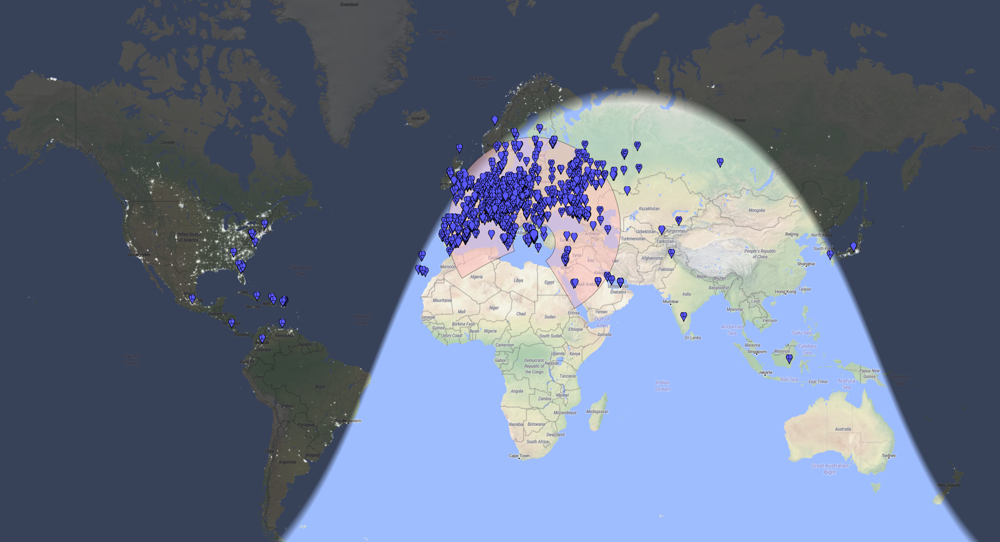
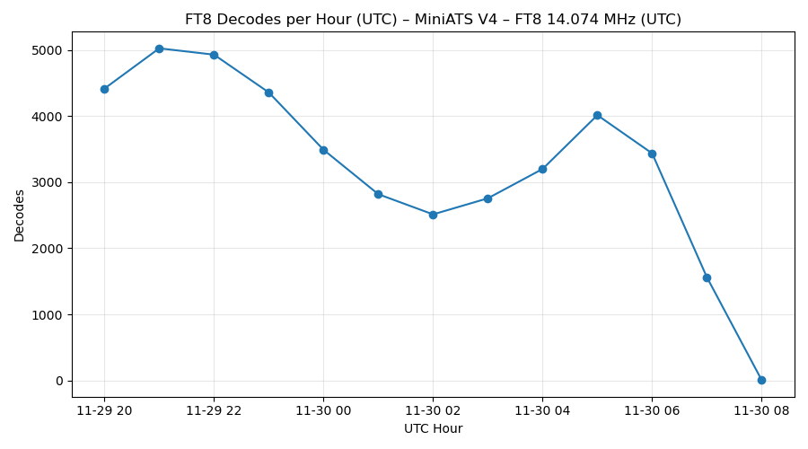
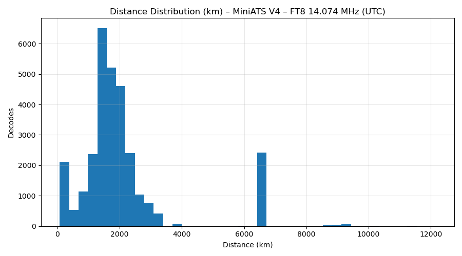
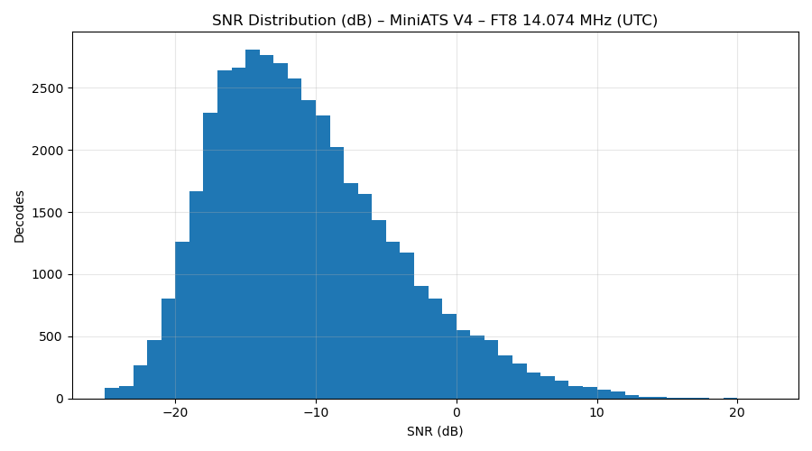

# FT8 Reception Test – 40 m (7074 kHz USB)  

---

## 📡 Test Setup

**Hardware chain:**  
- **Receiver:** MiniATS V4 (modded)  
- **Audio Interface:** Steinberg UR22C  
- **Software:** WSJT-X (logging to PSKReporter)  
- **Antenna:** Moonraker X1-HF  
- **QTH:** KM17UW (near sea level, urban environment)  
- **Mode:** FT8 @ 7074 kHz USB  
- **Date:** Saturday 29/11/2025 → Sunday 30/11/2025 (UTC)
- **Mods:** [Described here](../../Amnvolt_V4_mods)

---

## 📊 Summary Statistics

| Metric | Value |
|---|---|
| Total FT8 decodes | 42,509 |
| Decodes with locator | 29,797 |
| Unique stations (with locator) | 1,105 |
| Test duration | 29 Nov 20:09 → 30 Nov 08:00 UTC |
| Average SNR | –11.2 dB |
| SNR range | –25 … +22 dB |
| Average Δt | –0.31 s |
| Average distance | 2,057 km |
| Maximum distance | 12,148 km |

_All distances calculated from reported grid to KM17UW._

---

## ⏱️ Decodes Per Hour (UTC)

The activity curve is typical for 40 m:  
- strong early-night activity,  
- a dip around midnight,  
- a secondary peak before sunrise (greyline enhancement),  
- and a natural decline after 06:00 UTC.

---

## 📡 Distance Distribution

The histogram shows:

- **Main cluster:** 1000–2500 km  
  (classic 40 m night-time single-hop)

- **Secondary cluster:** 6000–7000 km  
  (double-hop or favourable long-path openings)

- **Sparse DX:** up to ~12,148 km  
  (multi-hop long-range events)

This demonstrates full-range propagation reception on 40 m.

---

## 🔊 SNR Distribution (dB)

Characteristic 40 m FT8 signature:

- Core density at **–20 to –5 dB**  
- Peak around **–12 dB**  
- Long tail into positive SNR values up to **+20 dB**

No signs of overload, distortion or environmental noise dominance.

---

## 🏅 Top 15 Stations by Maximum Distance

| Call | Count | Best SNR | Max Distance (km) | Last Grid |
|---|---|---|---|---|
| R | 5 | –15 | 12148.07 | DL08 |
| XE1RBV | 5 | –13 | 11349.46 | EK08 |
| TI5RTZ | 14 | –11 | 10881.18 | EK70 |
| YE7LOW | 1 | –20 | 10291.66 | OI77 |
| HK3W | 15 | –16 | 10285.48 | FJ34 |
| JF1FSR | 9 | –14 | 9480.04 | PM95 |
| YV5JDP | 9 | –14 | 9353.69 | FK60 |
| CO8LY | 3 | –15 | 9347.23 | FL20 |
| K1UHF | 37 | –18 | 9262.59 | EM80 |
| KE7BMG | 1 | –17 | 9258.01 | EL98 |
| W4TE | 12 | –8 | 9187.36 | EM73 |
| KT4WI | 3 | –20 | 9186.88 | RR73 |
| NN2T | 1 | –23 | 9115.91 | EM90 |
| JR6EZE | 9 | –10 | 9087.91 | PM53 |
| HI3QMT | 3 | –22 | 9085.64 | FK49 |

---

## 🏅 Top 15 Stations by Best SNR

| Call | Count | Best SNR | Max Distance (km) | Last Grid |
|---|---|---|---|---|
| IK5QPV | 7 | +19 | 1234.81 | JN53 |
| SP3HUU | 560 | +19 | 6429.59 | JO71 |
| SV1ENM | 19 | +19 | 87.98 | KM18 |
| IZ0ZIP | 16 | +18 | 6429.59 | RR73 |
| IW4DV | 21 | +17 | 6429.59 | RR73 |
| IZ8VYU | 150 | +16 | 6429.59 | JN71 |
| IZ2DVI | 23 | +16 | 6429.59 | JN45 |
| F4FGC | 21 | +15 | 1689.01 | JN23 |
| SV1EKI | 443 | +15 | 6429.59 | KM18 |
| IZ1JJA | 12 | +14 | 6429.59 | RR73 |
| SP2GJI | 28 | +14 | 6429.59 | RR73 |
| IK2RZQ | 19 | +14 | 1478.66 | JN45 |
| SQ6IMG | 204 | +13 | 6429.59 | JO80 |
| HZ1TT | 561 | +13 | 6429.59 | KL94 |
| IZ4FUA | 1 | +12 | 1478.66 | JN45 |

---

## 🧭 Conclusion

The **MiniATS V4 (modded)** paired with the **Moonraker X1-HF** demonstrates excellent 40 m FT8 reception performance:

- clean dynamic range  
- stable SNR characteristics  
- consistent decoding rate  
- strong mid-range coverage  
- and confirmed DX up to ~12,148 km

The results align closely with expected 40 m night-time propagation, showing that the system captures both NVIS and multi-hop long-distance openings with ease.

---

## 📁 Files 

Raw data:  

- [per_hour.csv](./per_hour.csv)
- [summary.csv](./summary.csv)
- [top15_by_distance.csv](./top15_by_distance.csv)
- [top15_by_snr.csv](./top15_by_snr.csv)
