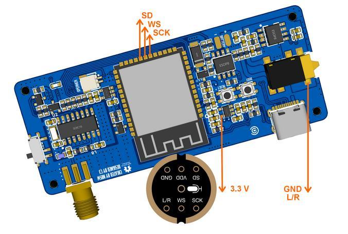
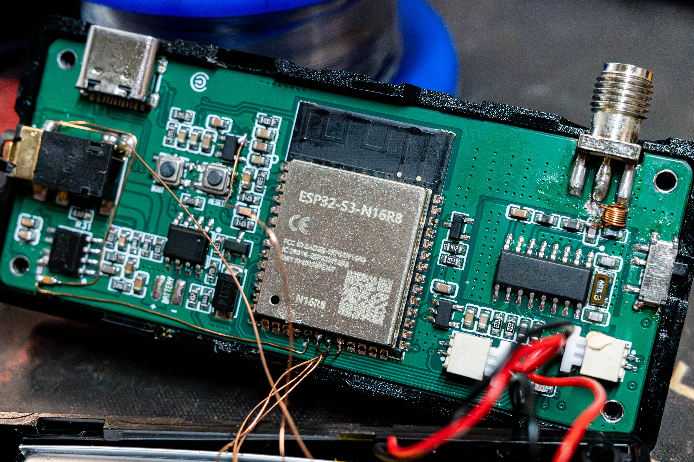
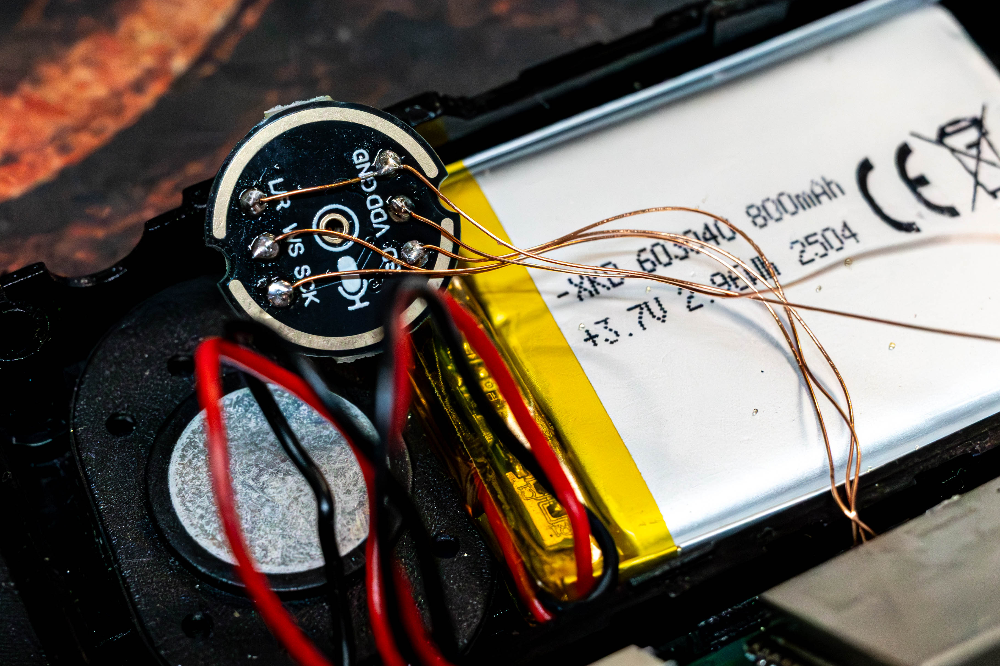
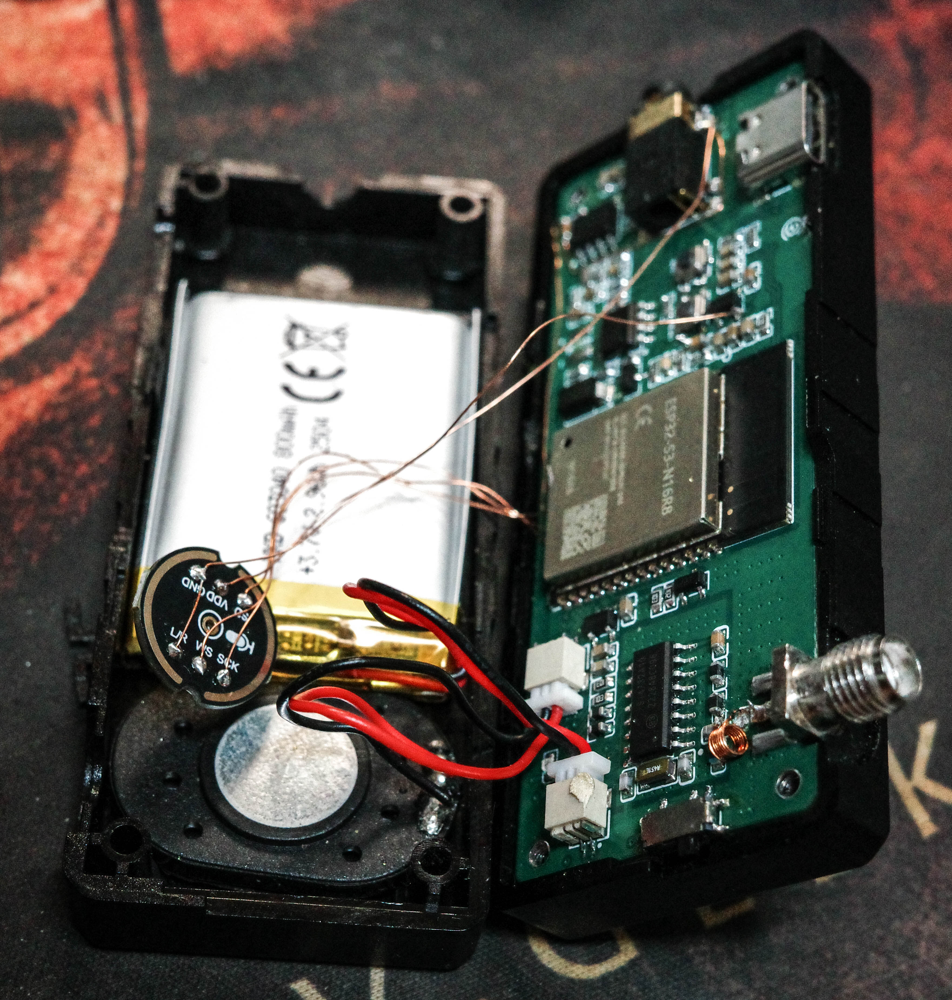
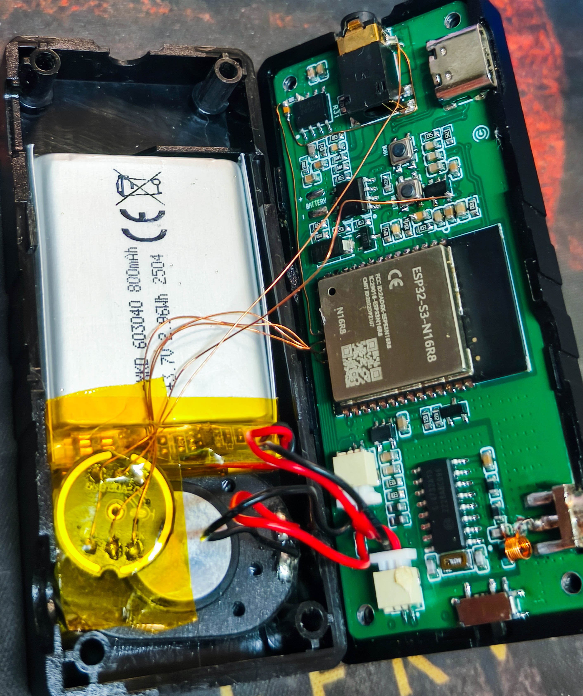
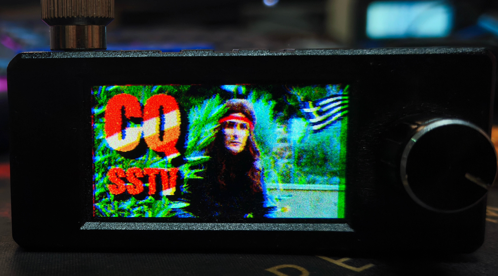

# MiniATS I2S Microphone (INMP441) Mod for SSTV and WeFAX

With the June 2026 firmware release, [H.J. Berndt](http://www.hjberndt.de/dvb/pocketSI4735DualCoreDecoder.html) introduced SSTV and WeFAX decoding support for the MiniATS. These new modes require the addition of an I2S digital microphone module based on the INMP441.

It is worth noting that CW and RTTY decoding already existed in previous firmware versions. Those modes require a different hardware modification, using an additional signal wire plus a simple resistor and capacitor circuit. This post focuses only on the SSTV and WeFAX microphone modification.

The mod was performed on my MiniATS V2, which has become my personal testing platform and has already received several other experimental modifications over time.

For the wiring, I used 0.2 mm enamel wire. Following [Peter Neufeld](https://peterneufeld.wordpress.com/)'s recommendation, I tried to keep the wires as short as possible to minimize noise pickup and interference. They could probably have been even shorter, but this was my first implementation and it worked successfully.
  
  
## Wiring Diagram

The SSTV/WeFAX firmware uses an INMP441 I2S microphone connected directly to the ESP32-S3. The diagram below shows the required wiring between the microphone module and the MiniATS board.

The L/R pin is tied to GND to select the left audio channel. All other connections follow the standard I2S interface used by the firmware.

  
  
| Pin | Description |
| --- | --- |
| SCK | Serial data clock for I2S interface |
| WS | Serial data word selection for I2S interface |
| L/R | Left/right channel selection. |
| | When set to low level: Microphone outputs signal on the left channel of I2S frames |
| | When set to high level: Microphone outputs signal on the right channel of I2S frames |
| SD | Serial data output for I2S interface |
| VCC | Input power supply (1.8V to 3.3V) |
| GND | Power ground |

> The INMP441 is a high-performance, low power, digital-output, omnidirectional MEMS microphone with a bottom port. The complete INMP441 solution consists of a MEMS sensor, signal conditioning, an analog-to-digital converter, anti-aliasing filters, power management, and an industry-standard 24-bit I²S interface.  
> The I²S interface allows the INMP441 to connect directly to digital processors, such as DSPs and microcontrollers, without the need for an audio codec in the system.  
> The INMP441 has a high SNR, making it an excellent choice for near field applications. The INMP441 has a flat wideband frequency response, resulting in natural sound with high intelligibility.  
  
  
## Photos

Soldering the wires directly to the ESP32-S3 GPIO pins.  
The previously added wire from the speaker output to an ESP32 GPIO pin is also visible. That earlier modification is used for CW/RTTY decoding.  

  
  
  
The other end of the wiring, soldered to the INMP441 microphone module.  

  
  
  
Ready for the first test before final securing.  
  
  
  
  
Kapton tape was used both to secure the microphone mechanically and to insulate it electrically, protecting it from possible short circuits inside the case.  

> **Update:** After publishing this mod, Peter Neufeld pointed out that the INMP441 microphone module shown in the photos is mounted upside down. The microphone side should actually face the speaker, whereas in my installation the opposite side is facing the speaker.  
  
Despite this, the modification worked correctly and SSTV reception was successful, but future installations should follow the recommended orientation.  
  
  
  
  
The first successful SSTV reception.  
The image was transmitted using a CRT SS9900V on 27.700 MHz USB and received by the MiniATS using the Martin 1 SSTV mode.  
  
  
## Video Demonstration
  
  
  
Click the image above to watch the video.  
  
  
## Result
  
The result is **quite impressive**, considering that SSTV images and weather fax charts can now be decoded directly on such a small portable receiver, without requiring a PC, smartphone, or external decoding software.  
  
  
## Disclaimer
  
This modification involves soldering **directly** to ESP32-S3 module pins and other parts and may damage the receiver if performed incorrectly. Proceed at your own risk.  
  
  
## References
  
- H.J. Berndt's firmware and documentation:  
  http://www.hjberndt.de/dvb/pocketSI4735DualCoreDecoder.html

- Peter Neufeld's experiments and notes:  
  https://peterneufeld.wordpress.com/

- INMP441 Datasheet:  
  [INMP441 Datasheet](INMP441-Datasheet.pdf)
