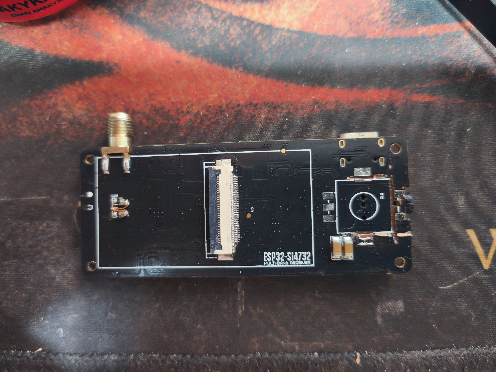
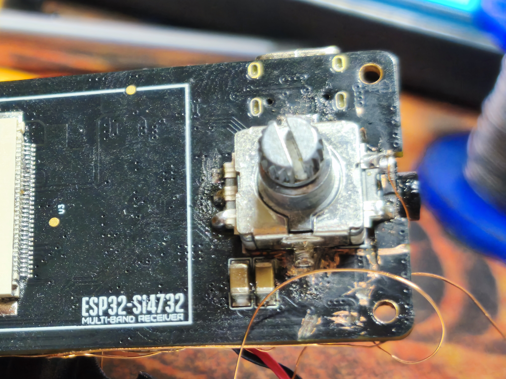
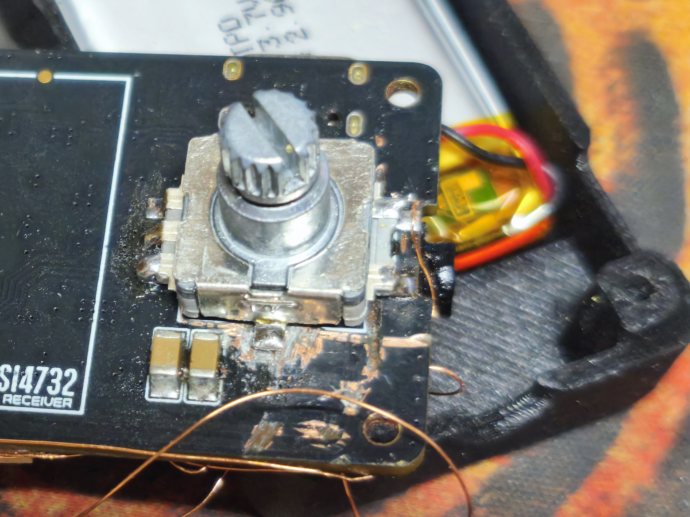
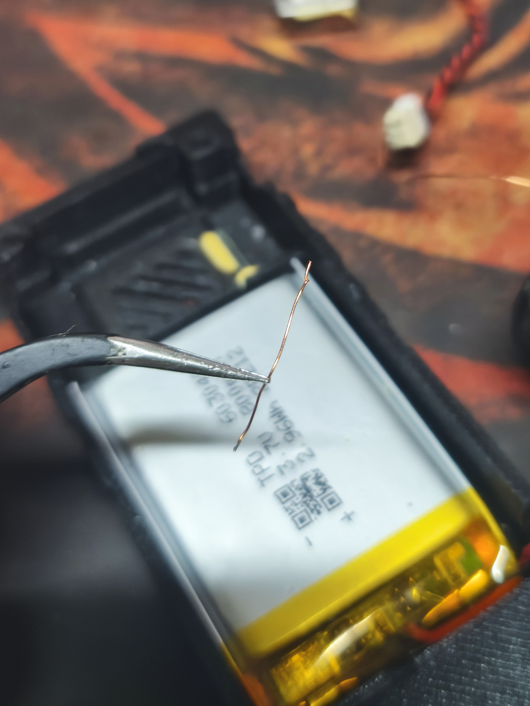
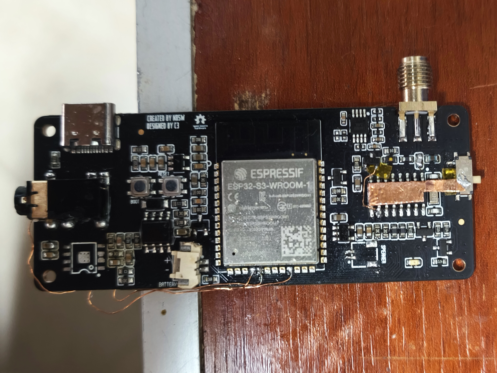
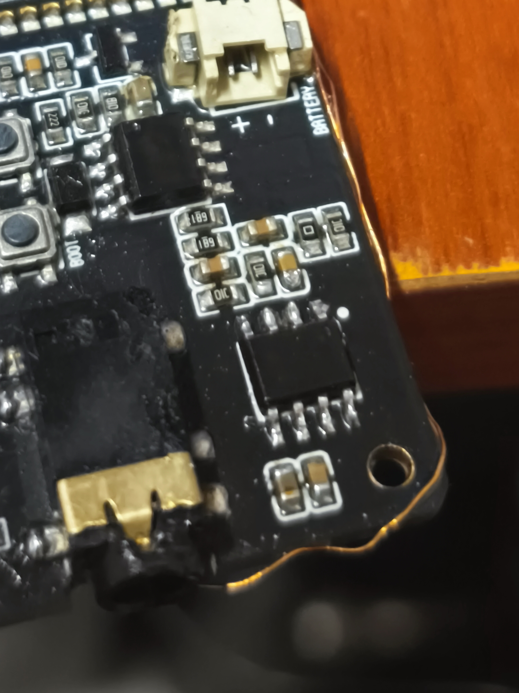
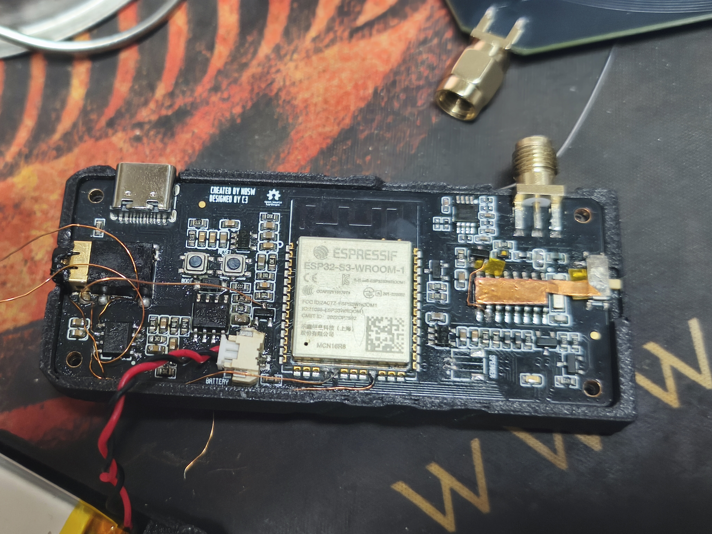
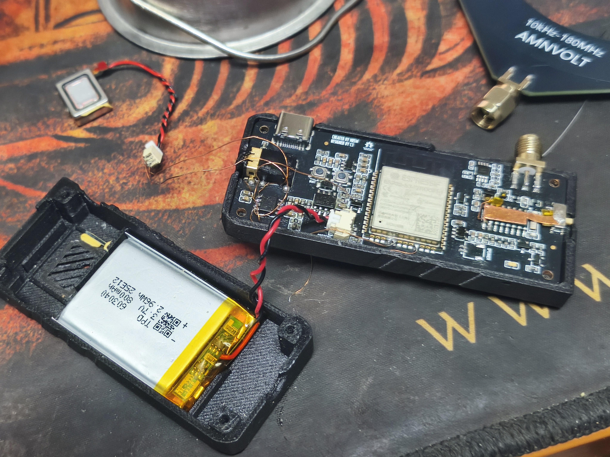
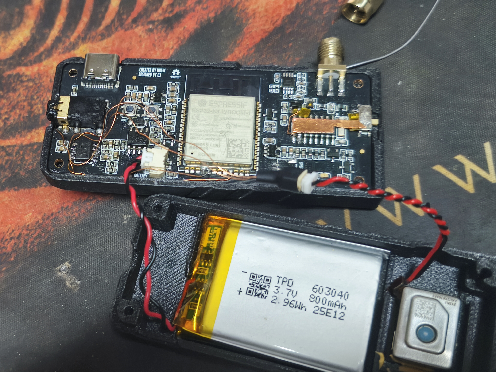
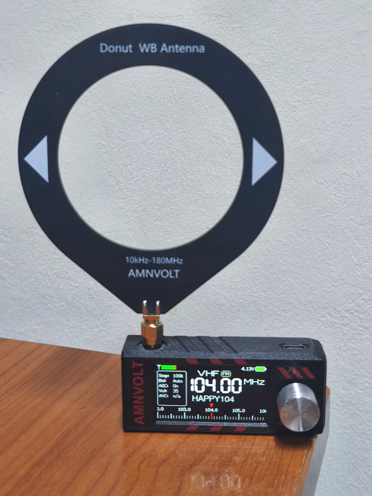

# AMNVOLT MiniATS V3 Si4732 Radio – Mods & Repair Story

## TL;DR
A long story follows.  
In short, here I will explain how you can spend (creatively, at least) countless hours of your life bringing back to life something of low value and mediocre construction quality, while the “fixed” version is already available on the market.

---

## The Beginning
A **MiniATS V3 by AMNVOLT** was purchased.  

This little radio basically consists of:  
- An ESP32 microcontroller  
- A SI4732 receiver IC  
- A NS4160 audio amplifier (the star of our story)  
- A headphone amplifier  
- A JFET for the High-Z input circuit on the antenna side  
  
It can receive AM, SSB (LSB/USB) and FM (WFM), covering LW/MW/SW (150 kHz–30 MHz) and VHF (FM) (64–108 MHz).  

---

## The Improvements
The High-Z circuit includes a JFET. There was, however, a design flaw: the JFET was permanently connected to the power rail.  
The result → **battery drain right out of the box**, draining the battery even when unused. A few days and goodbye battery!

The fix:  
- Several tests were made, and the ideal solution was to power it from a SI4732 pin which provides a “clean” supply.  
- This required lifting the JFET pin and rewiring it externally to cut the old line.  

Additionally, another wire was added connecting the **VOP pin** of the NS4160 to **GPIO11** of the ESP32, so that with proper firmware the device could “read” the audio signal and decode RTTY and CW.  

Detailed description of the **battery drain mod** can be found [here](../Hardware_Mod_for_V3_Battery_Drain/README.md).  
  
Also, a **comparison between V2 and V3** can be found [here](../V2_vs_V3/README.md).  

---

## The Encoder Problem
After the improvements, another classic issue appeared: the **encoder** stopped working properly. Its quality was very poor, most likely due to its size constraints.

Removing it with hot air or/and with a soldering iron was not successful. The pins were too long, too many, and too thick, so I couldn’t heat them all at once. Most people facing the same problem cut the pins with side cutters. I used a more brutal method: my beloved **dremel**.

  
*Removing the faulty encoder with a dremel, along with the scars left on the PCB.*

During cutting, metallic/plastic dust filled the holes, and since I wasn’t careful enough, I not only scratched the PCB but also cut several traces.  

Assuming it was just ground lines, I soldered in the new encoder.  
After placing it, rotation worked fine, but the **switch didn’t**.

After troubleshooting, I found that the switch output (SW pin in the V1 schematic) was not connected to the correct ESP32 pin. This was solved with a jumper wire.  

  
  
*New encoder installed, with a jumper wire to fix the cut trace.*

---

## The Amplifier Problem
After reassembling into the case, the speaker stopped working (headphones still worked).  

A wire from VOP (connected to the ESP32) had been cut and shorted.  

  
*When reassembling, this wire was cut and shorted half of the NS4160 bridge amplifier.*

Troubleshooting revealed that this had burned one half of the NS4160 bridge output.  

The solution: remove the NS4160.  
Using a soldering iron didn’t work. Looking at a reference screenshot, I realized the NS4160 had a ground pad underneath. This meant the entire pad had to be heated for desoldering – simply unsoldering the 8 pins wasn’t enough.  

Heating from the bottom was impossible due to other components, so I had to use plenty of flux and hot air.  

  
*The NS4160 removed.*  

After removal, and after ordering a replacement, a new NS4160 was installed:  

  
*Soldering in the new NS4160.*

---

## The Wires
During troubleshooting, some traces had also been cut.  
So, I decided to completely bypass them:  
- Two wires from the NS4160 directly to the speaker  
- One wire from VOP → ESP32 for decoding RTTY/CW  
- One power wire from NS4160 directly to the battery  
- One jumper wire from the encoder → ESP32  
- One wire from SI4732 → JFET for its new power line  

---

## Fixed
After all this, and after checking everything, finally the MiniATS V3 worked again.  

  
  
*All fixed – sound is back from the speaker.*

---

## Ready for the Case
  
*The receiver ready to go back into its case.*

---

## Was It Worth It?
The troubleshooting required a lot of **reverse engineering**.  
Unfortunately, there is no schematic for the MiniATS V3. The only one available is for the V1.  
There are some changes compared to V2/V3/V3S, but in the parts that mattered (encoder, NS4160) it was close enough.  

It took a lot of time to figure out exactly what was disconnected and why it wasn’t working. At first, it wasn’t clear whether the problem was the speaker, the amplifier, the encoder, or something else.  

Tools used:  
- Oscilloscope (to check SI4732 output, amplifier input, and amplifier output to the speaker)  
- Multimeter (to trace connections from the schematic, check power lines, and verify signals)  
- Wires (for new connections)  
- Utility knife (to cut shorted traces)  

The hours spent were many. Especially for me, since I am not an electronics engineer and my knowledge is limited. I already had the “fixed” V3S in my hands, so originally I thought of keeping this one for spare parts only.  

But, for some reason I don’t quite understand, I kept working on it – and in the end, I repaired it.  

**Was it worth it?**  
- Financially: no.  
- For satisfaction and maybe therapy: absolutely.  

---

## Let’s Enjoy It

