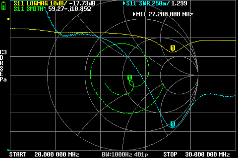

# Sirio GPS 1/2 – Reference Measurements (20–30 MHz)

This document contains the **reference measurements** of the **Sirio GPS 1/2 (½-wave vertical)** across **20–30 MHz**.
The measurements follow the same methodology and installation conditions as the Sirio Boomerang 27A measurements,
allowing a direct and meaningful comparison at a later stage.

---

## Antenna Description (Manufacturer Specs)

- **Type**: ½ λ vertical
- **Radiation pattern**: Omnidirectional
- **Polarization**: Linear vertical
- **Frequency range**: 26.4–29.0 MHz (tunable)
- **Gain**: 0 dBd (≈ 2.15 dBi)
- **Bandwidth**: ≥ 1.6 MHz @ SWR ≤ 2
- **Max Power**:
  - 250 W CW (continuous)
  - 750 W CW (short time)
- **Grounding / protection**: DC-grounded
- **Connector**: SO-239 (UHF female)

### Mechanical Characteristics

- **Materials**: Aluminium, Copper, Galvanized steel, Nylon
- **Height (approx.)**: 5950 mm (19.52 ft)
- **Weight (approx.)**: 2100 g (4.63 lb)
- **Mounting type**: On-mast

---

## Measurement Setup

- **Antenna**: Sirio GPS 1/2, installed as a replacement for the .
- **Purpose**: CB transmit/receive and operation around 27.700 MHz using a CRT SS9900V.
- **Instruments**:
  - **NanoVNA** – S11 / SWR / Return Loss sweep.
  - **tinySA** – Spectrum scan of received RF power / ambient noise.
- **Sweep Range**: 20–30 MHz

### Environmental & Installation Conditions (important)

These measurements were taken:

- with **~15 meters of RG58 coaxial cable**,  
- in a **densely built urban environment**,  
- with the antenna installed at a **significantly lower height than the surrounding buildings**.

These conditions inherently limit absolute received levels and may influence apparent bandwidth and matching due to interaction
with nearby structures. However, they are identical to those used for the Boomerang measurements and therefore suitable
for relative comparison.

---

## 1. NanoVNA – S11 / SWR / Return Loss (20–30 MHz)

### Key Results

- **Minimum SWR**:
  - Frequency: **27.225 MHz**
  - SWR_min ≈ **1.30 : 1**

- **Bandwidth for SWR ≤ 2 : 1**:
  - From **~25.8 MHz** to **≥30.0 MHz**
  - Effective bandwidth ≈ **≥4.2 MHz**

- **Approximate SWR ≤ 3 : 1**:
  - Extends well below 25 MHz and above 30 MHz (outside sweep limits)

### Representative Frequencies (CB, 10 m, and 15 m region)

> Note: 21.000 MHz lies in the **15 m amateur band region** (21.000–21.450 MHz).

| Frequency (MHz) | Sample (MHz) | SWR  | Notes |
|-----------------|--------------|------|------|
| 21.000          | 21.000       | ~3.24 | 15 m band, RX usable |
| 26.965 (CH1)    | 26.975       | ~1.34 | Lower CB |
| 27.125          | 27.125       | ~1.31 | CB region |
| 27.185 (CH19)   | 27.175       | ~1.30 | Near SWR minimum |
| 27.405 (CH40)   | 27.400       | ~1.33 | Upper CB |
| 27.700          | 27.700       | ~1.45 | Outside CB, TX safe |
| 28.000          | 28.000       | ~1.58 | Lower 10 m band |

> **NanoVNA Summary**  
> The GPS 1/2 maintains **consistently low SWR across a very wide frequency range**.
> This makes it significantly less tuning-sensitive and more tolerant of off-band operation.

- File: 

---

## 2. tinySA – Spectrum Analysis (20–30 MHz)

The tinySA measurement represents **ambient RF activity and received signal levels**, not impedance matching.

### Scan Settings

- Start: **20 MHz**
- Stop: **30 MHz**
- RBW: **10 kHz**
- Attenuation: **0 dB**
- File: 

### Average Level per 2 MHz Segment

| Range (MHz) | Avg (dBm) | Min (dBm) | Max (dBm) | Notes |
|-------------|-----------|-----------|-----------|-------|
| 20–22       | −85.96    | −92.28    | −80.28    | Elevated background |
| 22–24       | −87.68    | −96.28    | **−75.28**| Strong activity peak |
| 24–26       | −88.62    | −96.78    | −80.28    | Moderate activity |
| 26–28       | −86.00    | −95.28    | −78.28    | CB region |
| 28–30       | −88.35    | −97.28    | −81.78    | Quieter |

- **Peak level observed**:
  - Frequency ≈ **23.63 MHz**
  - Level ≈ **−75.28 dBm**

### Notable Frequencies

| Frequency (MHz) | Sample (MHz) | Level (dBm) | Notes |
|-----------------|--------------|-------------|-------|
| 21.000          | 21.002       | −87.75      | 15 m region |
| 26.965          | 26.971       | −84.28      | Lower CB |
| 27.185          | 27.194       | −85.28      | CB mid-band |
| 27.405          | 27.394       | −87.78      | Upper CB |
| 27.700          | 27.706       | −84.28      | Above CB |
| 28.000          | 27.996       | −85.78      | Lower 10 m |

> **tinySA Summary**  
> The GPS 1/2 shows generally elevated received levels across 20–30 MHz.
> Observed peaks strongly depend on real-time band activity and propagation,
> but the antenna demonstrates effective RF coupling across a wide frequency span.

---

## 3. Combined Interpretation (NanoVNA + tinySA)

- The **wide and flat SWR response** confirms that the GPS 1/2 is not tuning-critical across CB and into 10 m.
- The **tinySA results show effective broadband RF capture**, consistent with a ½-wave radiator that is less dependent on ground conditions.
- Performance at **21 MHz (15 m)** is clearly inferior to CB/10 m but remains usable for reception.

Overall, the Sirio GPS 1/2 behaves as a **broadband, electrically stable vertical**, well suited for CB and adjacent bands,
and forms a solid baseline for later antenna-to-antenna comparison.

---

## 4. Usable Bandwidth Observation

One of the most notable characteristics of the Sirio GPS 1/2 is its **exceptionally wide usable bandwidth**.

Although the absolute SWR minimum (~1.30) is not as low, the GPS 1/2 maintains
**consistently low SWR (≤ 2:1)** across a very broad frequency span (approximately **25.8 MHz to at least 30.0 MHz**
in this measurement), effectively covering:

- the entire CB band,
- operation around 27.700 MHz,
- and extending well into the 10 m band,

without requiring retuning or an antenna tuner.

According to the manufacturer specifications, the rated bandwidth is **≥ 1.6 MHz at SWR ≤ 2**.
The significantly wider span observed here reflects the specific installation and measurement conditions.

From a practical standpoint, this makes the GPS 1/2 far less sensitive to small installation changes
(height, nearby structures, feedline effects) and significantly more tolerant of off-band operation.
The antenna behaves as a **broadband, electrically stable radiator**, rather than a narrowly tuned CB-only antenna.

