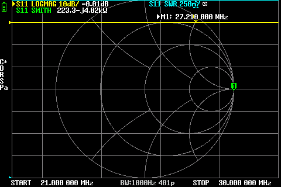
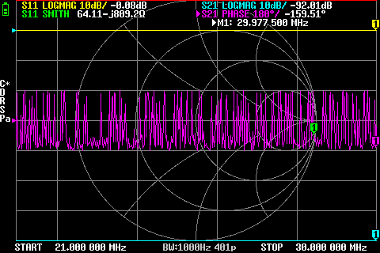
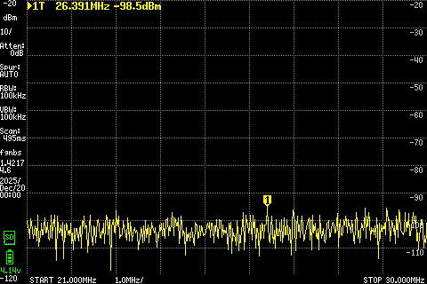
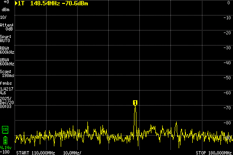
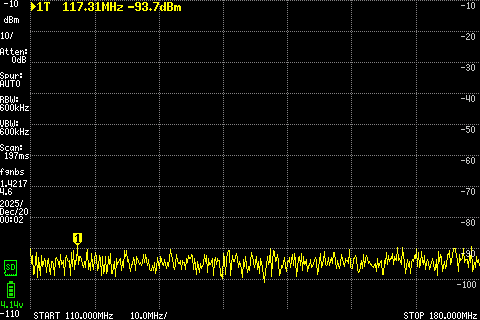
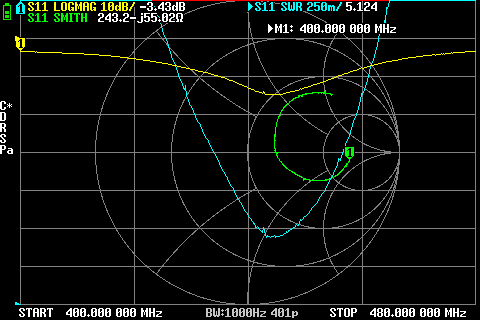
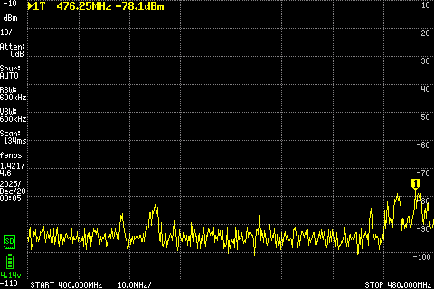
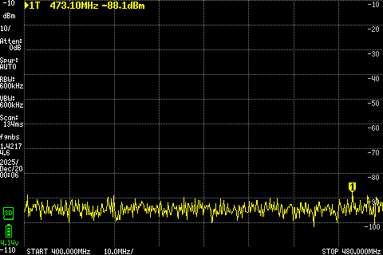

# Handheld Antenna Comparative Measurements (NanoVNA & tinySA)

This repository documents **comparative whip antenna measurements** across:

- **CB / 11 m (21-30 MHz)**
- **VHF / 2 m (110-180 MHz)**
- **UHF / 70 cm (400-480 MHz)**

The measurements are presented with plots from:
- **NanoVNA** (impedance/matching: S11, SWR)
- **tinySA** (relative receive level in a real RF environment)

⚠️ **Important:** All measurements were performed **for comparative purposes only**.

---

## Motivation (Why this repo exists)

This project started after purchasing a **Bajeton BJ-8200** handheld radio,
which was subsequently flashed with the **Bintolk BT-8200 BT (BT8200Pro_ENG_RUSS_V0.16(BT)) firmware**.

The radio provides wide frequency coverage:

- **TX/RX:** 18-108 MHz  
- **RX:** 108-136 MHz (airband)  
- **TX/RX:** 136-580 MHz  
- **TX/RX:** 760-999 MHz  

Supported modes:
- **TX:** FM  
- **RX:** FM / AM  

In practical use, the **stock BJ-8200 antenna** proved weak and inconsistent.
So the goal became:

> Try several antennas already on hand and determine **which antenna “fits” best**
> and **on which band** - using repeatable, comparable measurements.

---

## Antennas tested

### VHF/UHF handheld antennas
- **Abbree AR-771** (telescopic, dual-band VHF/UHF)
- **Diamond SRH789** (genuine, telescopic)
- **Diamond SRH805S** (clone, ultra-short)
- **Bajeton BJ-8200 stock antenna** (wideband rubber)

### CB / handheld CB antennas
- **Abbree CB02** (CB antenna)
- **Intek Handycom 90S stock rubber antenna**
- (The VHF/UHF antennas were also observed in CB range for completeness)

---

## Instruments

- **NanoVNA-H4**
  - Used to capture matching/resonance characteristics (S11, SWR)  
  - Firmware: DiSlord / NanoVNA-D v1.2.46  
- **tinySA Ultra+**
  - Used to compare receive behavior under a real RF environment
  - Firmware: tinySA4 v1.4-217

---

## Methodology & key disclaimers

### Setup
- **Direct SMA connection** (no coax cable)
- Same physical location, same orientation, same general setup per band, same time
- NanoVNA calibration at the SMA reference plane (where the antenna connects)

### Interpretation disclaimer (very important)

These measurements are **comparative only**:
- No anechoic chamber
- No absolute gain or radiation pattern measurements
- tinySA sees *whatever RF exists in the environment at the time*
- Absolute signal levels are not meaningful
- **Only relative differences between antennas tested under identical conditions are considered meaningful**

### Why direct-SMA matters
For handheld antennas, the “system” includes:
- antenna + radio chassis + user coupling (hand/body)

Measuring direct on NanoVNA/tinySA means the counterpoise is essentially the instrument body.
This is still valid **for comparison** (because conditions are identical), but it can penalize antennas that strongly depend on the handheld chassis.

---

## Why these results make sense

Some results may look counterintuitive at first (e.g., excellent SWR not always meaning strongest RX).
This is expected because:

- **SWR/matching ≠ efficiency**
  - A small antenna may be well matched but lossy (heat in loading coils, resistive losses)
- **Antenna length dominates VHF behavior**
  - Longer antennas tend to outperform ultra-short ones on 2 m
- **UHF allows smaller antennas, but trade-offs remain**
  - Tiny antennas can be tuned very sharply near a specific frequency
- **Real RF environment affects tinySA**
  - Multipath and signal density vary, but comparative differences remain meaningful under identical conditions

In practice, the measurements align with what experienced operators expect:
- AR-771 is VHF-strong
- ultra-short antennas can be UHF-specialized
- wideband stock rubbers often underperform

---

# CB Band (21-30 MHz)

## NanoVNA - CB

### Abbree CB02

### Diamond SRH789 (fully extended)

### Intek Handycom 90S rubber

### CB observations (what matters)
- The **Intek Handycom 90S rubber antenna** shows a clear resonance near **~29 MHz**
  (better matching and stronger RX behavior near that region).
- The **SRH789** is not designed for CB → behaves as heavily mismatched (expected).
- The **CB02** measured direct-SMA showed extremely poor matching across the sweep.
  This strongly suggests **counterpoise/chassis dependence** (typical for handheld CB antennas).

---

## tinySA - CB

### Abbree CB02

### Diamond SRH789

### Intek Handycom 90S

### CB RX summary (comparative)
- Intek rubber shows the clearest advantage near **~29 MHz**, consistent with NanoVNA resonance.
- In the core CB channels, differences are smaller and more environment-dependent, which is expected.

---

# VHF Band (110-180 MHz)

## NanoVNA - VHF

### Abbree AR-771

### Diamond SRH789 (genuine)

### Diamond SRH805S (clone, tiny)

### Bajeton BJ-8200 stock

### VHF matching summary (comparative)
- **AR-771** shows the cleanest and strongest resonance within VHF → best matching behavior.
- **SRH789** is strong but slightly more compromise-shaped.
- **SRH805S** is size-limited on VHF (shallow resonance / loading losses).
- **BJ-8200 stock** shows weak/non-optimized VHF behavior.

---

## tinySA - VHF

### Abbree AR-771

### Diamond SRH789

### Diamond SRH805S

### Bajeton BJ-8200 stock

### VHF RX summary (comparative)
- **AR-771** delivers the strongest and most consistent VHF reception.
- **SRH789** follows closely as a balanced dual-band antenna.
- **SRH805S** and **BJ-8200 stock** trail behind (expected given size/compromise).

---

# UHF Band (400-480 MHz)

## NanoVNA - UHF

### Abbree AR-771

### Diamond SRH789 (genuine)

### Diamond SRH805S (clone, tiny)

### Bajeton BJ-8200 stock

### UHF matching summary (comparative)
- **SRH805S** shows excellent, narrow UHF matching near the 70 cm region (UHF-first behavior).
- **AR-771** shows very good UHF performance with broader usability.
- **SRH789** remains usable but more compromise-shaped.
- **BJ-8200 stock** again performs poorly in this measurement setup.

---

## tinySA - UHF

### Abbree AR-771

### Diamond SRH789

### Diamond SRH805S

### Bajeton BJ-8200 stock

### UHF RX summary (comparative)
- AR-771 shows strong overall receive behavior across the sweep.
- SRH789 remains stable and usable as a dual-band option.
- SRH805S is best viewed as UHF-specialized and convenience-driven (size trade-off).
- BJ-8200 stock is consistently weak.

---

## Overall summary (practical)

This is not an “absolute best antenna” list - it is the **most practical conclusion** from the comparative measurements:

- **Best overall dual-band (VHF/UHF):** **Abbree AR-771**
- **Balanced dual-band, solid performer:** **Diamond SRH789 (genuine)**
- **Pocket / compact, UHF-leaning:** **Diamond SRH805S (clone)**
- **Stock BJ-8200 antenna:** underperforms (confirmed by both NanoVNA and tinySA)
- **CB note:** Intek Handycom 90S rubber resonates near ~29 MHz; CB02 appears highly counterpoise-dependent in direct-SMA testing

---

## Final note

This repository documents **real-world comparative behavior** under identical conditions.
Results can vary with:
- handheld chassis coupling
- user grip/body coupling
- local RF environment

Use the plots and notes as a **practical comparison tool**, not as certified lab specs.
